# Monotrum 기술 R&D 문서

**작성자**: 이성규  
**프로젝트명**: Monotrum (모노트럼)  
**개발 환경**: Unity 6 LTS / C# / URP / Cinemachine 3 / Beautify 3  
**연구 목표**: 실시간 오디오 데이터의 시각적 안정화, 절차적 3D 터널 생성, 물리 기반 카메라 연출의 수학적 구현 및 최적화

---

**작성일**: 2026-03-06  
**최종 수정**: 2026-03-16  
**작성자**: 이성규

---

## 목차

1. [시스템 아키텍처 전체도](#1-시스템-아키텍처-전체도)
2. [클래스 다이어그램](#2-클래스-다이어그램)
3. [실시간 오디오 스펙트럼 분석 (FFT Pipeline)](#3-실시간-오디오-스펙트럼-분석-fft-pipeline)
4. [절차적 터널 생성 (Procedural Tunnel Generation)](#4-절차적-터널-생성-procedural-tunnel-generation)
5. [SpeedRatio 단일 제어점 아키텍처](#5-speedratio-단일-제어점-아키텍처)
6. [테이프 스톱 연출 (AudioMixer Snapshot System)](#6-테이프-스톱-연출-audiomixer-snapshot-system)
7. [물리 기반 카메라 제어 및 오디오 임펄스](#7-물리-기반-카메라-제어-및-오디오-임펄스)
8. [SRP Batcher와 머티리얼 프로퍼티 접근 방식](#8-srp-batcher와-머티리얼-프로퍼티-접근-방식)
9. [옵저버 패턴 기반 이벤트 아키텍처](#9-옵저버-패턴-기반-이벤트-아키텍처)
10. [씬 전환 흐름 및 생명주기 안전 처리](#10-씬-전환-흐름-및-생명주기-안전-처리)
11. [성능 최적화 종합](#11-성능-최적화-종합)

---

## 1. 시스템 아키텍처 전체도

Monotrum의 전체 시스템은 **두 축**으로 구성된다.

- **SpeedRatio (제어축)**: 플레이어 입력 → Lerp 보간 → 0.0~1.0 비율로 전체 시스템 동기화
- **audioPulse (반응축)**: FFT → 8밴드 압축 → 스무딩 → 저음부(BandBuffer[0]) 기반 시각 반응

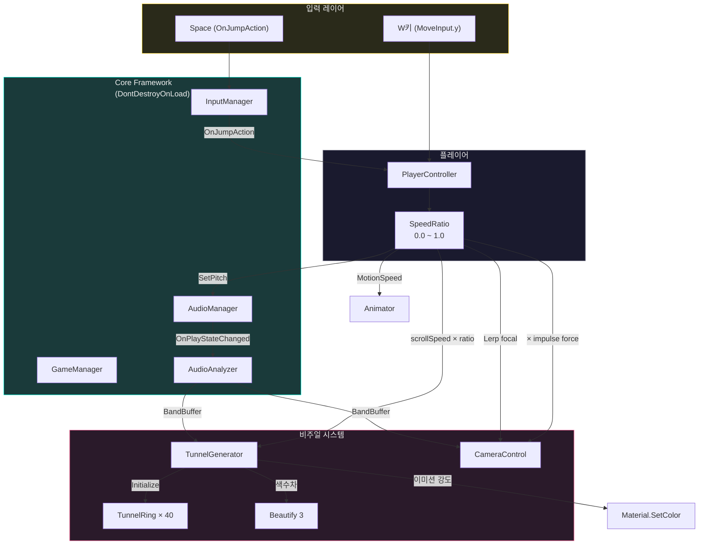
```mermaid
%%{init: {'flowchart': { 'nodeSpacing': 120 }}}%%
flowchart TB
    subgraph Input["입력 레이어"]
        W["W키 (MoveInput.y)"]
        SPACE["Space (OnJumpAction)"]
    end

    subgraph Core["Core Framework<br/>(DontDestroyOnLoad)"]
        GM["GameManager"]
        IM["InputManager"]
        AM["AudioManager"]
        AA["AudioAnalyzer"]
    end

    subgraph Player["플레이어"]
        PC["PlayerController"]
        SR["SpeedRatio<br/>0.0 ~ 1.0"]
    end

    subgraph Visual["비주얼 시스템"]
        TG["TunnelGenerator"]
        TR["TunnelRing × 40"]
        CC["CameraControl"]
        BF["Beautify 3"]
    end

    W --> PC --> SR
    SPACE --> IM -->|OnJumpAction| PC
    AM -->|OnPlayStateChanged| AA
    AA -->|BandBuffer| TG
    AA -->|BandBuffer| CC

    SR -->|MotionSpeed| ANIM["Animator"]
    SR -->|scrollSpeed × ratio| TG
    SR -->|SetPitch| AM
    SR -->|Lerp focal| CC
    SR -->|× impulse force| CC

    TG -->|Initialize| TR
    TG -->|이미션 강도| MAT["Material.SetColor"]
    TG -->|색수차| BF

    style Input fill:#2A2A1A,stroke:#FFD93D,color:#F0F0F0
    style Core fill:#1A3A3A,stroke:#00E5CC,color:#F0F0F0
    style Player fill:#1A1A2E,stroke:#8A8A9A,color:#F0F0F0
    style Visual fill:#2A1A2A,stroke:#FF6B9D,color:#F0F0F0
```

> **플레이 영상**  
> [](https://youtu.be/BigXLCgWW_8?si=Lt6b4mDk2dWcQB78)

---

## 2. 클래스 다이어그램

프로젝트의 전체 클래스 관계를 UML 클래스 다이어그램으로 표현한다. 싱글톤 상속 구조, 컴포넌트 간 참조, 이벤트 구독 관계를 한눈에 파악할 수 있다.

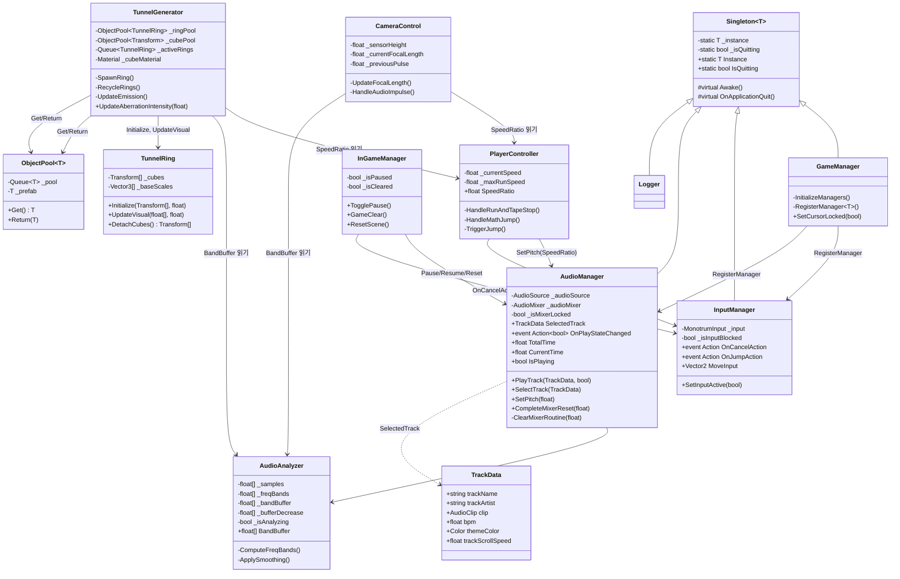
```mermaid

classDiagram
    class Singleton~T~ {
        -static T _instance
        -static bool _isQuitting
        +static T Instance
        +static bool IsQuitting
        #virtual Awake()
        #virtual OnApplicationQuit()
    }

    class GameManager {
        -InitializeManagers()
        -RegisterManager~T~()
        +SetCursorLocked(bool)
    }

    class InputManager {
        -MonotrumInput _input
        -bool _isInputBlocked
        +event Action OnCancelAction
        +event Action OnJumpAction
        +Vector2 MoveInput
        +SetInputActive(bool)
    }

    class AudioManager {
        -AudioSource _audioSource
        -AudioMixer _audioMixer
        -bool _isMixerLocked
        +TrackData SelectedTrack
        +event Action~bool~ OnPlayStateChanged
        +float TotalTime
        +float CurrentTime
        +bool IsPlaying
        +PlayTrack(TrackData, bool)
        +SelectTrack(TrackData)
        +SetPitch(float)
        +CompleteMixerReset(float)
        -ClearMixerRoutine(float)
    }

    class AudioAnalyzer {
        -float[] _samples
        -float[] _freqBands
        -float[] _bandBuffer
        -float[] _bufferDecrease
        -bool _isAnalyzing
        +float[] BandBuffer
        -ComputeFreqBands()
        -ApplySmoothing()
    }

    class TrackData {
        +string trackName
        +string trackArtist
        +AudioClip clip
        +float bpm
        +Color themeColor
        +float trackScrollSpeed
    }

    class PlayerController {
        -float _currentSpeed
        -float _maxRunSpeed
        +float SpeedRatio
        -HandleRunAndTapeStop()
        -HandleMathJump()
        -TriggerJump()
    }

    class TunnelGenerator {
        -ObjectPool~TunnelRing~ _ringPool
        -ObjectPool~Transform~ _cubePool
        -Queue~TunnelRing~ _activeRings
        -Material _cubeMaterial
        -SpawnRing()
        -RecycleRings()
        -UpdateEmission()
        +UpdateAberrationIntensity(float)
    }

    class TunnelRing {
        -Transform[] _cubes
        -Vector3[] _baseScales
        +Initialize(Transform[], float)
        +UpdateVisual(float[], float)
        +DetachCubes() Transform[]
    }

    class CameraControl {
        -float _sensorHeight
        -float _currentFocalLength
        -float _previousPulse
        -UpdateFocalLength()
        -HandleAudioImpulse()
    }

    class ObjectPool~T~ {
        -Queue~T~ _pool
        -T _prefab
        +Get() T
        +Return(T)
    }

    class InGameManager {
        -bool _isPaused
        -bool _isCleared
        +TogglePause()
        +GameClear()
        +ResetScene()
    }

    Singleton~T~ <|-- GameManager
    Singleton~T~ <|-- InputManager
    Singleton~T~ <|-- AudioManager
    Singleton~T~ <|-- Logger

    GameManager --> InputManager : RegisterManager
    GameManager --> AudioManager : RegisterManager
    AudioManager --> AudioAnalyzer : OnPlayStateChanged
    AudioManager ..> TrackData : SelectedTrack
    PlayerController --> AudioManager : SetPitch(SpeedRatio)
    PlayerController --> InputManager : OnJumpAction 구독
    TunnelGenerator --> PlayerController : SpeedRatio 읽기
    TunnelGenerator --> AudioAnalyzer : BandBuffer 읽기
    TunnelGenerator --> TunnelRing : Initialize, UpdateVisual
    TunnelGenerator --> ObjectPool~TunnelRing~ : Get/Return
    TunnelGenerator --> ObjectPool~Transform~ : Get/Return
    CameraControl --> PlayerController : SpeedRatio 읽기
    CameraControl --> AudioAnalyzer : BandBuffer 읽기
    InGameManager --> AudioManager : Pause/Resume/Reset
    InGameManager --> InputManager : OnCancelAction 구독
```

---

## 3. 실시간 오디오 스펙트럼 분석 (FFT Pipeline)

`AudioSource.GetSpectrumData`가 반환하는 512개의 스펙트럼 데이터는 고주파로 갈수록 에너지가 낮아지고, 매 프레임 값이 급변하여 시각화 시 화면이 떨리는(Jittering) 현상이 발생한다. 이를 해결하기 위해 데이터 압축과 스무딩 알고리즘을 도입했다.

### 3-1. FFT 원본 데이터 수집

```csharp
private float[] _samples = new float[512];
```

`GetSpectrumData`가 반환하는 FFT 결과를 담는 배열이다. 512개의 샘플은 오디오 신호를 512개 주파수 구간(bin)으로 분해한 것으로, 각 인덱스가 특정 주파수 대역의 진폭(amplitude)을 나타낸다.

**왜 512인가?** `GetSpectrumData`는 2의 거듭제곱(64, 128, 256, 512, 1024...)만 허용한다. 512는 주파수 해상도와 성능의 균형점으로, 1024 이상은 정밀하지만 연산이 무겁고 256 이하는 저음부 해상도가 부족하다.

**주파수 해상도 계산:** 샘플레이트가 44100Hz일 때 각 bin의 주파수 폭은 `44100 / 2 / 512 ≈ 43Hz`이다. 즉 `_samples[0]`은 0 ~ 43Hz, `_samples[1]`은 43 ~ 86Hz 구간의 에너지를 담고 있다.

```csharp
AudioManager.Instance.GetSpectrumData(_samples);
```

내부적으로 `AudioSource.GetSpectrumData(_samples, 0, FFTWindow.Blackman)`이 호출된다. 배열을 새로 생성하지 않고 기존 배열에 덮어쓴다.

**FFTWindow.Blackman을 쓰는 이유:** FFT는 유한한 길이의 신호를 잘라서 분석하는데, 이 절단면에서 **스펙트럼 누출(Spectral Leakage)**이 발생한다. 윈도우 함수는 신호의 양 끝을 부드럽게 감쇠시켜 이를 완화한다. Blackman은 누출 억제력이 강해서 음악 분석에 적합하다. 반면 Rectangular(윈도우 없음)은 누출이 심하고, Hanning은 Blackman보다 가벼우나 누출 억제가 약하다.

**스펙트럼 누출(Spectral leakage)**: 신호를 스펙트럼 분석 했을 때, 원래의 신호에는 포함되어 있지 않은 주파수 성분이 관측되는 현상. 원래의 신호 스펙트럼 주위의 주파수에 누설이 된 것과 같은 에너지가 관측되어 이와 같이 부른다.  
[스펙트럼 누설 - 위키백과](https://ko.wikipedia.org/wiki/%EC%8A%A4%ED%8E%99%ED%8A%B8%EB%9F%BC_%EB%88%84%EC%84%A4)

### 3-2. 지수적 주파수 밴드 압축 (8-Band Compression)

인간의 청각은 고주파보다 저주파(베이스/킥)의 변화에 훨씬 예민하게 반응한다. 따라서 512개의 bin을 선형으로 나누지 않고, 지수적으로 할당하여 저음부를 세밀하게 분리했다.

**밴드별 할당 공식:**

$$SampleCount_i = 2^i \times 2 \quad (i = 0, 1, ..., 7)$$

```csharp
int sampleCount = (int)Mathf.Pow(2, i) * 2;
if (i == 7) sampleCount += 2; // 510 → 512 보정
```

| 밴드 | bin 수 | 누적 bin | 대략적 주파수 범위 |
|------|--------|----------|-------------------|
| 0 | 2 | 0~1 | 0~86Hz (서브베이스) |
| 1 | 4 | 2~5 | 86~258Hz (베이스) |
| 2 | 8 | 6~13 | 258~602Hz (저중음) |
| 3 | 16 | 14~29 | 602~1290Hz (중음) |
| 4 | 32 | 30~61 | 1290~2666Hz (중고음) |
| 5 | 64 | 62~125 | 2666~5418Hz (고음) |
| 6 | 128 | 126~253 | 5418~10922Hz (초고음) |
| 7 | 258 | 254~511 | 10922~22050Hz (초고음+) |

**가중치 보상 공식:**

$$Average_i = \frac{\sum_{j} (Sample_{count} \times (count + 1))}{TotalCount}$$

```csharp
average += _samples[count] * (count + 1);
```

디지털 오디오 특성상 고주파 대역으로 갈수록 FFT 에너지 값 자체가 급격히 낮아진다. 이를 보상하기 위해 뒤쪽 인덱스일수록 더 큰 값인 $(count+1)$을 곱해주는 가중치를 적용하여, 모든 주파수 대역의 큐브가 고르게 반응하도록 정규화했다.

### 3-3. 가속 감쇠 스무딩 알고리즘 (Accelerated Decay Smoothing)

음악 비트에 맞춰 커진 큐브가 원래 크기로 돌아갈 때, 값을 그대로 적용하면 움직임이 딱딱하고 프레임 단위의 떨림이 발생한다. "올라갈 때는 빠르고, 내려갈 때는 부드러운" 비주얼라이저 특유의 움직임을 구현하기 위해 가속 감쇠 알고리즘을 적용했다.

**상승 시 — 즉시 반영 (비트 반응성 확보):**

```csharp
if (_freqBands[g] > _bandBuffer[g])
{
    _bandBuffer[g] = _freqBands[g];     // 즉시 반영
    _bufferDecrease[g] = 0.005f;         // 감쇠 속도 초기화
}
```

**하강 시 — 가속 감쇠 (자연스러운 곡선 하강):**

$$Buffer_g = Buffer_g - Decrease_g$$

$$Decrease_g = Decrease_g \times 1.2$$

```csharp
if (_freqBands[g] < _bandBuffer[g])
{
    _bandBuffer[g] -= _bufferDecrease[g];
    _bufferDecrease[g] *= 1.2f;
}
```

매 프레임 빼주는 감쇠값($Decrease$)을 1.2배씩 가속 증가시킨다. 이는 물리적인 '중력'을 모방한 것으로, 비트 직후에는 큐브가 공중에 잠깐 체공하듯 멈춰 있다가 점점 가속도가 붙으며 떨어지는 자연스러운 곡선 하강 연출을 만들어낸다.

### 3-4. 데이터 흐름 요약

> 타이틀 씬의 8큐브 비주얼라이저 바가 오디오에 반응하는 모습
> 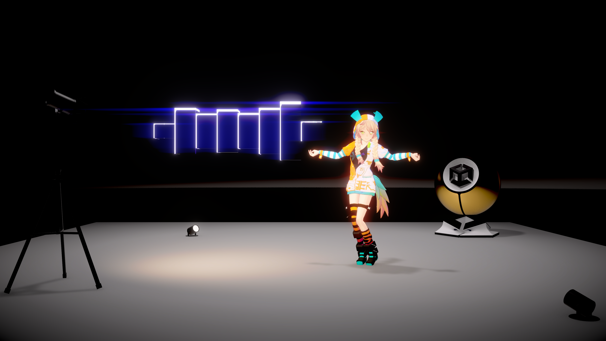

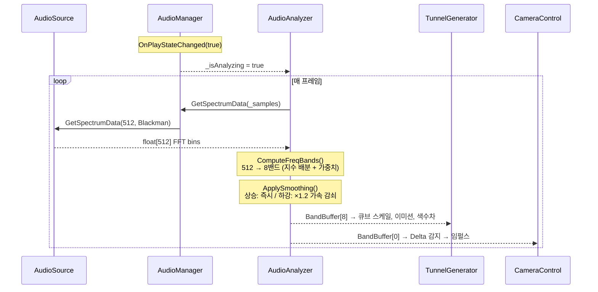
```mermaid
sequenceDiagram
    participant AS as AudioSource
    participant AM as AudioManager
    participant AA as AudioAnalyzer
    participant TG as TunnelGenerator
    participant CC as CameraControl

    Note over AM: OnPlayStateChanged(true)
    AM-->>AA: _isAnalyzing = true

    loop 매 프레임
        AA->>AM: GetSpectrumData(_samples)
        AM->>AS: GetSpectrumData(512, Blackman)
        AS-->>AA: float[512] FFT bins

        Note over AA: ComputeFreqBands()<br/>512 → 8밴드 (지수 배분 + 가중치)

        Note over AA: ApplySmoothing()<br/>상승: 즉시 / 하강: ×1.2 가속 감쇠

        AA-->>TG: BandBuffer[8] → 큐브 스케일, 이미션, 색수차
        AA-->>CC: BandBuffer[0] → Delta 감지 → 임펄스
    end
```

---

## 4. 절차적 터널 생성 (Procedural Tunnel Generation)

> - 터널 내부 인게임 뷰  
> 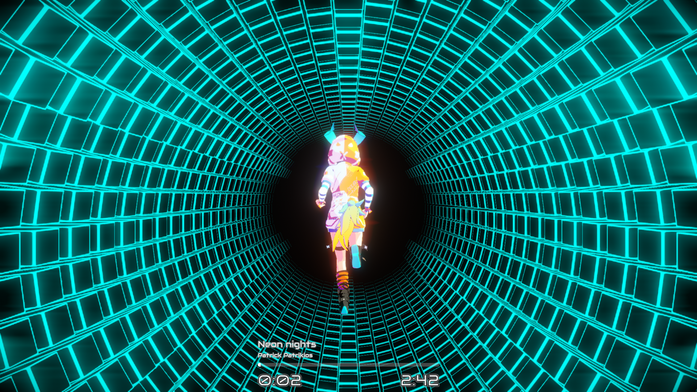
> - 씬 뷰에서 본 터널 전체 구조  
> 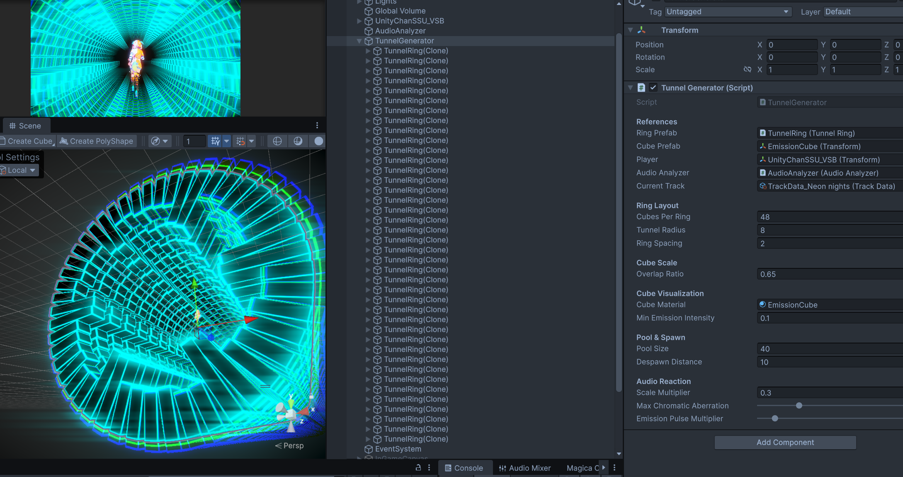


### 4-1. 삼각함수를 활용한 3D 방사형 배치

N개의 큐브를 원형으로 배치하기 위해, 각도를 라디안으로 변환한 뒤 코사인과 사인을 통해 원주 상의 좌표를 산출한다.

**좌표계 및 라디안 변환 공식:**

$$\theta = \frac{360°}{N} \times i \times \frac{\pi}{180}$$

$$Position = (r \cdot \cos(\theta),\ r \cdot \sin(\theta),\ 0)$$

```csharp
float angle = (360f / count) * i * Mathf.Deg2Rad;
Vector3 pos = new Vector3(
    Mathf.Cos(angle) * radius,
    Mathf.Sin(angle) * radius,
    0f
);
```

X축에 Cos, Y축에 Sin을 넣으면 XY 평면에서 원형이 그려지고, Z는 0이라 링 하나가 하나의 평면에 존재한다. TunnelGenerator가 링마다 Z를 다르게 배치하면 터널이 된다.

추가로 방사 방향 정렬을 위해 큐브의 로컬 X축이 중심에서 바깥을 향하도록 배치 각도만큼 Z축 회전을 적용한다.

```csharp
_cubes[i].localRotation = Quaternion.Euler(0f, 0f, angle * Mathf.Rad2Deg);
```

### 4-2. 빈틈 방지 오버랩 및 단방향 스케일링

> **큐브 중첩 해결 전후 비교**  
> - **스케일링 중 이미션 라인 겹침 문제**  
>   
> - **방사 방향 스케일링 + 피벗 조정 후**  
> 

**호 길이 기반 두께 산출:**

$$ArcLength = \frac{2\pi r}{N}$$

```csharp
float arcLength = 2f * Mathf.PI * _tunnelRadius / _cubesPerRing;
```

큐브가 오디오에 반응하여 부피 전체가 커지면 이웃한 큐브와 겹치며 Z-Fighting이 발생한다. 이를 막기 위해:

1. 터널 반경과 큐브 개수로 완벽한 호의 길이를 자동 계산하여 기본 스케일을 잡음
2. 오디오 반응 시에는 **방사 방향(로컬 X축)으로만 스케일 가산**
3. 프리팹의 피벗을 왼쪽 옆면 중심으로 이동하여 **터널 안쪽으로만 확장**

```csharp
/// <summary>
/// 링 풀에서 링을, 큐브 풀에서 큐브를 꺼내 조립한 뒤
/// 호 길이 기반으로 빈틈 없는 스케일을 자동 산출하여 원형 배치한다.
/// </summary>
private void SpawnRing()
{
    TunnelRing ring = _ringPool.Get();
    ring.transform.position = new Vector3(0f, 0f, _nextSpawnZ);

    Transform[] cubes = new Transform[_cubesPerRing];
    for (int i = 0; i < _cubesPerRing; i++)
        cubes[i] = _cubePool.Get();

    // ── 호 길이 계산: 원둘레(2πr)를 큐브 수(N)로 나눈 값 ──
    float arcLength = 2f * Mathf.PI * _tunnelRadius / _cubesPerRing;

    for (int i = 0; i < _cubesPerRing; i++)
    {
        cubes[i].localScale = new Vector3(
            arcLength,                        // X: 방사 방향 (터널 두께)
            arcLength * _overlapRatio,        // Y: 호 방향 (1.05× 오버랩으로 미세한 틈 방지)
            _ringSpacing * _overlapRatio      // Z: 터널 진행 방향 (링 간격에 맞춤)
        );
    }

    ring.Initialize(cubes, _tunnelRadius);
    _activeRings.Enqueue(ring);
    _nextSpawnZ += _ringSpacing;
}
```

오디오 반응 시에는 이 기본 스케일을 보존한 채 방사 방향(X)만 가산하여 이웃 큐브와의 겹침을 원천 차단한다.

```cs
// UpdateVisual: 밴드 데이터 → 방사 방향 단방향 스케일링
// Y(호 방향), Z(진행 방향)는 고정 → 옆/앞뒤 큐브와 절대 겹치지 않음
_cubes[i].localScale = new Vector3(
    _baseScales[i].x + scale,   // 오디오 반응값을 방사 방향에만 가산
    _baseScales[i].y,            // SpawnRing에서 계산한 호 방향 크기 유지
    _baseScales[i].z             // SpawnRing에서 계산한 링 간격 크기 유지
);
```

### 4-3. 오브젝트 풀링 (Object Pooling)

터널 큐브는 플레이어 전방에 생성되고 후방으로 벗어나면 회수되는 순환 구조이므로, 매번 Instantiate/Destroy 대신 오브젝트 풀링으로 재사용한다.

`Queue<T>` 기반 FIFO 구조의 제네릭 풀(`ObjectPool<T> where T : Component`)로 구현했다. 링 풀과 큐브 풀을 분리 운영하여 각각 독립적으로 관리한다.

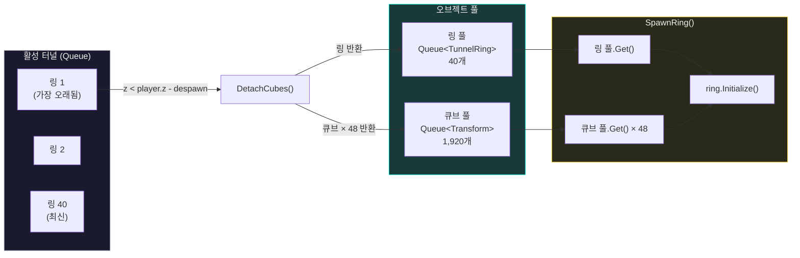
```mermaid
flowchart LR
    subgraph Pool["오브젝트 풀"]
        RP["링 풀<br/>Queue&lt;TunnelRing&gt;<br/>40개"]
        CP["큐브 풀<br/>Queue&lt;Transform&gt;<br/>1,920개"]
    end

    subgraph Active["활성 터널 (Queue)"]
        R1["링 1<br/>(가장 오래됨)"]
        R2["링 2"]
        RN["링 40<br/>(최신)"]
    end

    subgraph Spawn["SpawnRing()"]
        GET_R["링 풀.Get()"]
        GET_C["큐브 풀.Get() × 48"]
        INIT["ring.Initialize()"]
    end

    RP --> GET_R --> INIT
    CP --> GET_C --> INIT

    R1 -->|"z < player.z - despawn"| DETACH["DetachCubes()"]
    DETACH -->|"큐브 × 48 반환"| CP
    DETACH -->|"링 반환"| RP

    style Pool fill:#1A3A3A,stroke:#00E5CC,color:#F0F0F0
    style Active fill:#1A1A2E,stroke:#8A8A9A,color:#F0F0F0
    style Spawn fill:#2A2A1A,stroke:#FFD93D,color:#F0F0F0
```

### 4-4. 트레드밀(런닝머신) 방식 무한 스크롤

플레이어가 앞으로 나아가는 대신, 터널 전체가 플레이어를 향해 `-Z`로 이동한다. 플레이어를 실제로 이동시키면 float 좌표의 스케일 한계로 먼 거리에서 Jittering이 발생할 수 있기 때문에 세계를 움직이는 방식을 선택했다.

```csharp
float moveStep = _currentTrack.trackScrollSpeed * _playerController.SpeedRatio * Time.deltaTime;

foreach (var ring in _activeRings)
    ring.transform.position += Vector3.back * moveStep;

// 핵심: 링 이동량만큼 다음 스폰 좌표도 동기화
_nextSpawnZ -= moveStep;
```

**발견 및 수정한 버그:**

1. **`_nextSpawnZ` 이격 현상**: 링들은 매 프레임 `-Z`로 이동하는데 다음 스폰 좌표는 고정되어 있어, 시간이 지나면 새 링이 기존 터널과 동떨어져 생성. → `_nextSpawnZ -= moveStep`으로 동기화
2. **스케일 덮어쓰기**: `Vector3.one * scale`로 직육면체 비율이 매 프레임 정육면체로 리셋. → `_baseScales` 배열에 초기 스케일 보존 후 방사 방향만 가산

---

## 5. SpeedRatio 단일 제어점 아키텍처

게임의 핵심 설계. PlayerController에서 이미 계산하고 있던 `_currentSpeed / _maxRunSpeed` 비율(0.0~1.0)을 `SpeedRatio` 프로퍼티로 노출하고, 이 하나의 값으로 모든 시스템을 동기화한다.

```csharp
public float SpeedRatio
{
    get
    {
        float ratio = _currentSpeed / _maxRunSpeed;
        if (ratio > 0.99f) return 1f;  // 상단 스냅
        if (ratio < 0.01f) return 0f;  // 하단 스냅
        return ratio;
    }
}
```

**Lerp 스냅의 필요성:** `Mathf.Lerp`는 목표값에 수렴만 하고 도달하지 않는 특성이 있어(5.99, 0.99 등), 음악 재생 속도에 미세한 손실이 발생한다. 0.99 이상을 1.0으로, 0.01 이하를 0.0으로 스냅하여 끝단에서 정확한 값을 보장한다.

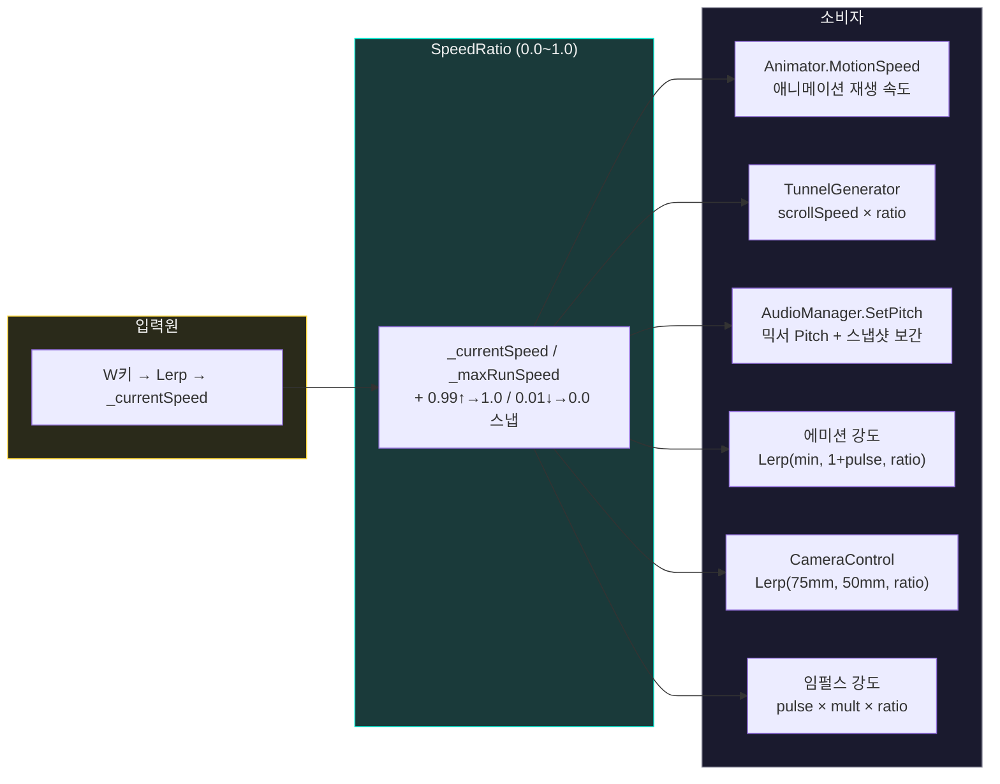
```mermaid
flowchart LR
    subgraph Source["입력원"]
        W["W키 → Lerp → _currentSpeed"]
    end

    subgraph Ratio["SpeedRatio (0.0~1.0)"]
        SR["_currentSpeed / _maxRunSpeed<br/>+ 0.99↑→1.0 / 0.01↓→0.0 스냅"]
    end

    subgraph Consumers["소비자"]
        A["Animator.MotionSpeed<br/>애니메이션 재생 속도"]
        B["TunnelGenerator<br/>scrollSpeed × ratio"]
        C["AudioManager.SetPitch<br/>믹서 Pitch + 스냅샷 보간"]
        D["에미션 강도<br/>Lerp(min, 1+pulse, ratio)"]
        E["CameraControl<br/>Lerp(75mm, 50mm, ratio)"]
        F["임펄스 강도<br/>pulse × mult × ratio"]
    end

    W --> SR
    SR --> A
    SR --> B
    SR --> C
    SR --> D
    SR --> E
    SR --> F

    style Source fill:#2A2A1A,stroke:#FFD93D,color:#F0F0F0
    style Ratio fill:#1A3A3A,stroke:#00E5CC,color:#F0F0F0
    style Consumers fill:#1A1A2E,stroke:#8A8A9A,color:#F0F0F0
```

**설계 이점:**
- 각 시스템이 같은 값을 읽어 자연스러운 동기화 보장
- 제어점이 하나이므로 디버깅과 튜닝이 단순
- 새 시스템 추가 시 SpeedRatio만 읽으면 즉시 연동

---

## 6. 테이프 스톱 연출 (AudioMixer Snapshot System)

W키를 놓으면 "세계의 시간이 멈추는" 연출을 AudioMixer 스냅샷 보간으로 구현했다.

> **Beautify 적용 전후 비교 (`포스트 프로세싱 에셋`)**
> 

### 6-0. 테이프 스톱 연출 시퀀스

W키 해제부터 재입력까지의 전체 연출 흐름을 시퀀스 다이어그램으로 표현한다.

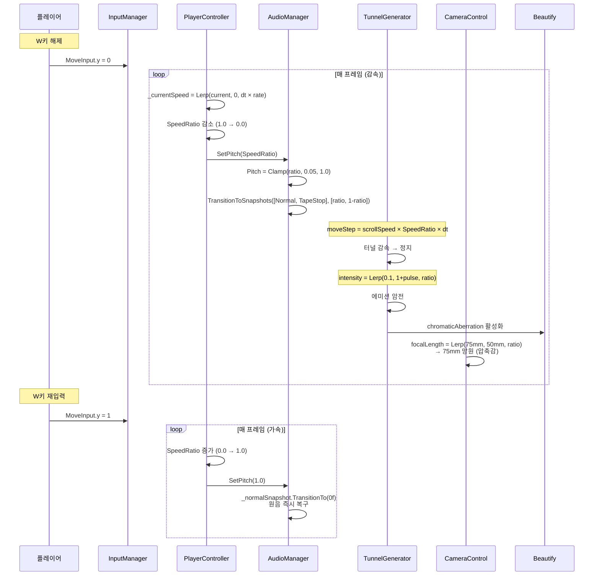
```mermaid
sequenceDiagram
    participant User as 플레이어
    participant IM as InputManager
    participant PC as PlayerController
    participant AM as AudioManager
    participant TG as TunnelGenerator
    participant CC as CameraControl
    participant BF as Beautify

    Note over User: W키 해제
    User->>IM: MoveInput.y = 0

    loop 매 프레임 (감속)
        PC->>PC: _currentSpeed = Lerp(current, 0, dt × rate)
        PC->>PC: SpeedRatio 감소 (1.0 → 0.0)

        PC->>AM: SetPitch(SpeedRatio)
        AM->>AM: Pitch = Clamp(ratio, 0.05, 1.0)
        AM->>AM: TransitionToSnapshots([Normal, TapeStop], [ratio, 1-ratio])

        Note over TG: moveStep = scrollSpeed × SpeedRatio × dt
        TG->>TG: 터널 감속 → 정지

        Note over TG: intensity = Lerp(0.1, 1+pulse, ratio)
        TG->>TG: 에미션 암전
        TG->>BF: chromaticAberration 활성화

        CC->>CC: focalLength = Lerp(75mm, 50mm, ratio)<br/>→ 75mm 망원 (압축감)
    end

    Note over User: W키 재입력
    User->>IM: MoveInput.y = 1

    loop 매 프레임 (가속)
        PC->>PC: SpeedRatio 증가 (0.0 → 1.0)
        PC->>AM: SetPitch(1.0)
        AM->>AM: _normalSnapshot.TransitionTo(0f)<br/>원음 즉시 복구
    end
```

### 6-1. AudioMixer를 경유하는 이유

`AudioSource.pitch`를 직접 건드리지 않고 AudioMixer를 경유하면, Pitch 외에 Lowpass Filter, SFX Reverb 등 추가 이펙트를 스냅샷으로 한 번에 전환할 수 있어 확장성이 높다. AudioMixer는 Unity 에셋이라 런타임에 동적 생성이 불가능하므로 에디터에서 생성하여 인스펙터에 할당한다.

### 6-2. 스냅샷 설계

Normal(원음)과 TapeStop 두 개의 스냅샷을 만들어 SpeedRatio로 보간한다.

| 파라미터 | Normal (원음) | Tape Stop | 제어 방식 |
|----------|---------------|-----------|-----------|
| Lowpass Cutoff | 22000 Hz (필터 해제) | 400 Hz (고음 차단) | 스냅샷 보간 |
| Reverb Room | -10000 (비활성) | -1000 (잔향 확산) | 스냅샷 보간 |
| Pitch | 1.0 (정상) | 0.05 (테이프 스톱) | **SetFloat 별도 제어** |

**Pitch를 스냅샷에서 분리한 이유:** Pitch를 스냅샷과 SetFloat 양쪽에서 동시에 제어하면 충돌이 발생한다. Pitch는 SetFloat로만 제어하고, Lowpass/Reverb만 스냅샷에 담아 역할을 분리했다.

### 6-3. 스냅샷 보간 로직

```csharp
public void SetPitch(float ratio)
{
    if (_audioMixer == null || _isMixerLocked) return;
    _audioMixer.SetFloat(PITCH_PARAM, Mathf.Clamp(ratio, 0.05f, 1f));

    // 정속이면 Normal로 즉시 전환 (원음 보장)
    if (ratio >= 1f)
    {
        _normalSnapshot.TransitionTo(0f);
        return;
    }

    // 스냅샷 보간: ratio 1→Normal, 0→TapeStop
    _audioMixer.TransitionToSnapshots(
        new[] { _normalSnapshot, _tapeStopSnapshot },
        new[] { ratio, 1f - ratio },
        Time.deltaTime  // 즉시 추종
    );
}
```

**피치 하한 0.05f의 이유:** 0이 되면 소리가 완전히 끊기지만, 0.05에서는 "찌익—" 하고 늘어지는 테이프 스톱 특유의 느낌이 살아있다.

**ratio >= 1일 때 즉시 전환하는 이유:** Lowpass 보간에 의한 미세한 컷오프 손실(21999Hz)을 방지하여 완전한 원음을 보장한다.

**보간 시간을 `Time.deltaTime`으로 설정한 이유:** 스냅샷이 SpeedRatio를 즉시 추종하도록 하여, 부드러운 감속의 원천은 PlayerController의 Lerp 하나로 통일. 이중 보간 방지.

### 6-4. CompleteMixerReset (씬 전환 시 완전 초기화)

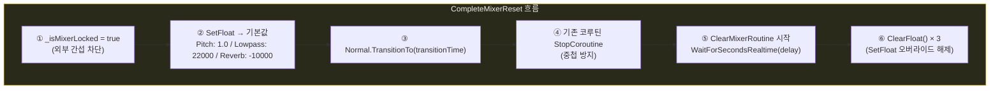
```mermaid
flowchart TB
    subgraph Reset["CompleteMixerReset 흐름"]
        LOCK["① _isMixerLocked = true<br/>(외부 간섭 차단)"]
        SET["② SetFloat → 기본값<br/>Pitch: 1.0 / Lowpass: 22000 / Reverb: -10000"]
        SNAP["③ Normal.TransitionTo(transitionTime)"]
        STOP["④ 기존 코루틴 StopCoroutine<br/>(중첩 방지)"]
        CLEAR["⑤ ClearMixerRoutine 시작<br/>WaitForSecondsRealtime(delay)"]
        FREE["⑥ ClearFloat() × 3<br/>(SetFloat 오버라이드 해제)"]
    end

    LOCK --> SET --> SNAP --> STOP --> CLEAR --> FREE

    style Reset fill:#2A2A1A,stroke:#FFD93D,color:#F0F0F0
```

**ClearFloat이 필요한 이유:** Unity AudioMixer의 특성상, `SetFloat`으로 조작한 파라미터는 이후 `Snapshot.TransitionTo()`를 호출해도 스냅샷의 통제를 벗어나 이전 값을 유지한다. `ClearFloat()`을 명시적으로 호출해야 파라미터 오버라이드가 완전히 풀린다.

**WaitForSecondsRealtime을 쓰는 이유:** 게임 클리어 직후 `Time.timeScale = 0`이 되면 일반 `WaitForSeconds`가 영원히 대기 상태에 빠진다. 타임 스케일 영향을 받지 않는 `WaitForSecondsRealtime`으로 교체.

---

## 7. 물리 기반 카메라 제어 및 오디오 임펄스

단순히 수치적인 시야각(FOV)이나 무작위 화면 흔들림을 지양하고, 실제 물리 카메라 렌즈의 특성과 정밀한 오디오 타격점을 역산하여 속도감과 타격감을 연출했다.

> **카메라 인스펙터 세팅 (Physical Camera + Cinemachine)**  
> - **시네머신 카메라 Lens 설정 (Focal Length, Sensor Size)**  
> 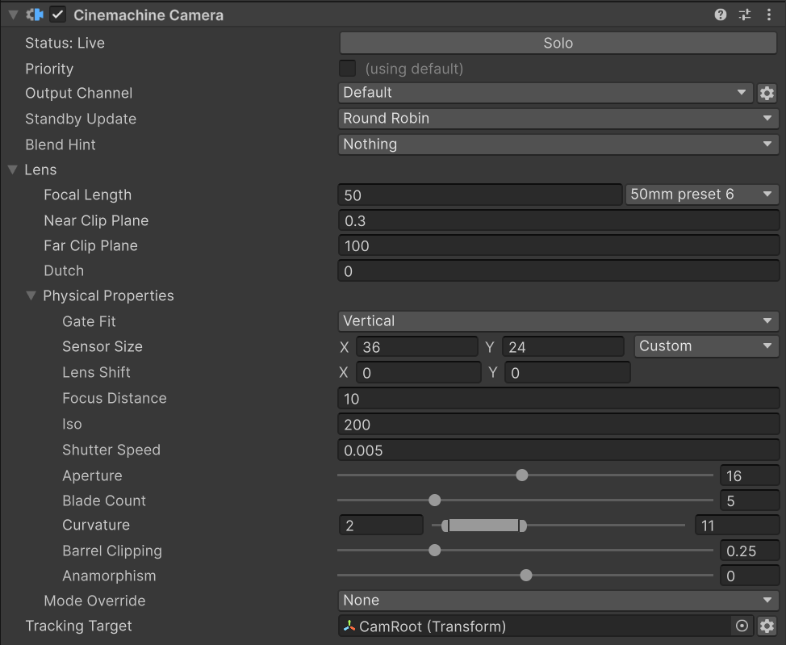  
> - **CinemachineImpulseSource 설정 (Uniform + Bump 커브)**  
> 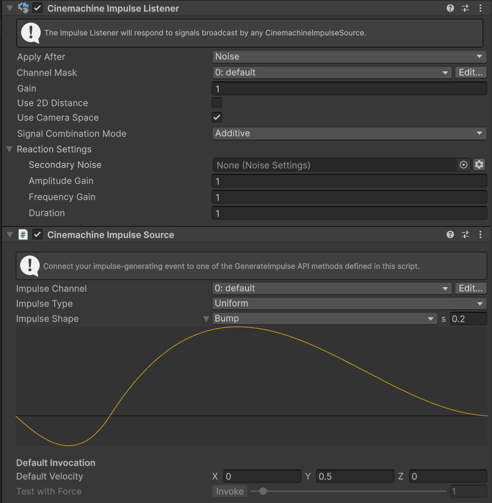  
> - **CameraControl 인스펙터 (idleFocalLength: 75, runFocalLength: 50)**  
> 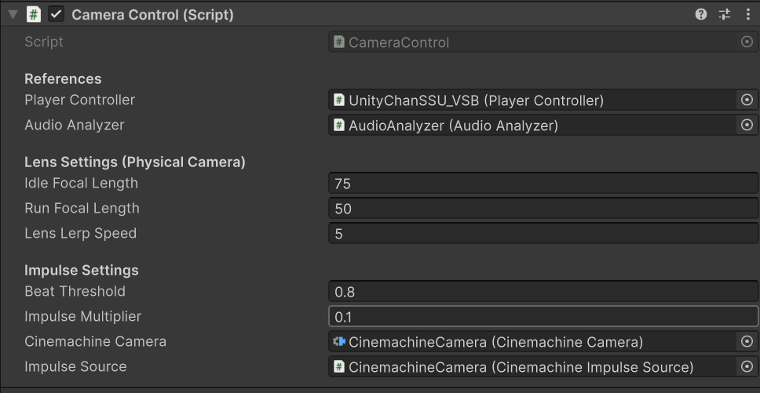  

### 7-1. 역삼각함수를 활용한 초점 거리(Focal Length) → FOV 변환

카메라 내부의 빛의 경로를 직각삼각형으로 가정한다.

- **밑변(Adjacent)**: 렌즈에서 센서까지의 거리 = $f$ (focalLength, 예: 50mm)
- **높이(Opposite)**: 센서 높이의 절반 = $\frac{h}{2}$ (sensorHeight / 2, 예: 12mm)
- **각도**: 전체 시야각의 절반 = $\frac{FOV}{2}$

**탄젠트로 비율 구하기:**

$$\tan\left(\frac{FOV}{2}\right) = \frac{h}{2f}$$

**아크탄젠트로 각도 역산:**

$$\frac{FOV}{2} = \arctan\left(\frac{h}{2f}\right)$$

**전체 시야각 복원 + 라디안→디그리 변환:**

$$FOV = 2 \cdot \arctan\left(\frac{h}{2f}\right) \cdot \frac{180}{\pi}$$

```csharp
float fov = 2f * Mathf.Atan(_sensorHeight / (2f * _currentFocalLength)) * Mathf.Rad2Deg;
```

센서 높이는 하드코딩하지 않고 시네머신 카메라의 `Lens.PhysicalProperties.SensorSize.y`를 런타임에 읽어 사용한다.

**속도감 연출:** 정지 시 75mm 망원 렌즈(좁은 화각, 터널 압축감)에서 최고 속도 시 50mm 표준 렌즈(넓은 화각, 자연스러운 속도감)로 Lerp 보간한다.

### 7-2. 변화량(Delta) 기반 오디오 임펄스 제어

오디오의 절대 볼륨이 클 때 화면을 흔들면 베이스의 잔향(Decay)으로 인해 연속적인 진동이 발생하여 멀미를 유발한다.

**타격점 추출 공식:**

$$\Delta Pulse = Pulse_{current} - Pulse_{previous}$$

$$Force = Pulse_{current} \times Multiplier \times SpeedRatio$$

이전 프레임 대비 값이 급격히 튀어 오르는 순간($\Delta Pulse > Threshold$)만을 킥(Kick) 비트로 판정하여 단타형 임펄스를 발생시킨다.

```csharp
float pulseDelta = currentPulse - _previousPulse;

if (pulseDelta > _beatThreshold && _shakeCooldown <= 0f)
{
    float finalForce = currentPulse * _impulseMultiplier * _playerController.SpeedRatio;
    _impulseSource.GenerateImpulseWithForce(finalForce);
    _shakeCooldown = 0.25f;
}
_previousPulse = currentPulse;
```

**상황별 제어:**
- `SpeedRatio < 0.05f` → 연산 스킵 (정지 시 멀미 방지)
- 강도에 SpeedRatio를 곱하여 빠르게 달릴수록 타격감이 거세지는 다이내믹 텐션
- 쿨타임(0.25초)으로 연속 발동 방지

---

## 8. SRP Batcher와 머티리얼 프로퍼티 접근 방식

48(링당 큐브) × 40(링 수) = 1920개의 큐브 이미션을 매 프레임 갱신해야 하는 상황에서, 프로퍼티 접근 방식에 따라 SRP Batcher가 무력화되거나 글로벌 값이 무시되는 문제가 발생했다.

### 8-1. SRP Batcher의 CBUFFER 우선순위
 
SRP Batcher는 같은 셰이더를 쓰는 오브젝트의 머티리얼 프로퍼티를 GPU 측 `UnityPerMaterial` CBUFFER에 캐싱하여 한 번에 그린다. 이 CBUFFER는 셰이더 내부에서 **글로벌 변수보다 우선순위가 높기 때문에**, 프로퍼티 접근 방식에 따라 결과가 완전히 달라진다.

### 8-2. 시행착오와 원인 분석
 
| 방식 | 결과 | 원인 |
|------|------|------|
| `Shader.SetGlobalColor` | **무반응** | 글로벌 셰이더 변수를 세팅하지만, SRP Batcher의 `UnityPerMaterial` CBUFFER가 같은 이름의 프로퍼티를 이미 캐싱하고 있어 글로벌 값을 덮어씀. 결과적으로 글로벌 값이 무시됨. |
| `Renderer.material` | **배칭 파괴** | 접근하는 순간 머티리얼 인스턴스가 복제됨. 1920개 큐브가 전부 다른 머티리얼이 되어 SRP Batcher가 "같은 머티리얼"로 인식하지 못함. 배칭이 깨지고 드로우 콜이 폭증. |
| `sharedMaterial.SetColor` | **정상 동작** | 공유 머티리얼의 CBUFFER를 직접 갱신. 모든 큐브가 같은 머티리얼을 참조하므로 SRP Batcher가 정상 배칭하면서 에미션 값도 일괄 반영됨. |
 
**핵심 교훈:** SRP Batcher 환경에서 런타임 프로퍼티 변경이 필요하면, `Shader.SetGlobalXXX`(CBUFFER에 가려짐)도 `Renderer.material`(인스턴스 복제)도 아닌 **`sharedMaterial`을 통한 직접 갱신**이 유일하게 배칭과 양립하는 방법이다. 다만 이 방식은 해당 머티리얼을 공유하는 모든 오브젝트가 동시에 바뀌므로, 개별 오브젝트마다 다른 값이 필요하다면 `MaterialPropertyBlock`이나 인스턴싱을 검토해야 한다.

### 8-3. 최종 구현

```csharp
private static readonly int EmissionColor = Shader.PropertyToID("_EmissionColor");

// 매 프레임
float intensity = Mathf.Lerp(_minEmissionIntensity, 1f + audioPulse, _playerController.SpeedRatio);
_cubeMaterial.SetColor(EmissionColor, _currentTrack.themeColor * intensity);
```

**이미션 강도 수식:**

$$Intensity = Lerp(minEmission,\ 1 + audioPulse,\ SpeedRatio)$$

- SpeedRatio 1 → themeColor 원본 + 오디오 맥박
- SpeedRatio 0 → minEmission(10%)까지 암전, 펄스 무효화

**색수차 연동:**
- 입력값 ($Value$): audioPulse * maxAberration (음악 비트와 설정된 최대치의 곱)
- 최솟값 ($Min$): 0 (색수차가 아예 없는 상태)
- 최댓값 ($Max$): 0.1 (화면 왜곡이 가독성을 해치지 않는 한계치)

0.1이 최대치인 이유는 Beautify의 색수차 최대수치가 0.1이기 때문이다.

$$ChromaticAberration = Clamp(audioPulse \times maxAberration,\ 0,\ 0.1)$$

```csharp
BeautifySettings.settings.chromaticAberrationIntensity.Override(finalIntensity);
```

### 8-4. GPU Resident Drawer (Unity 6)

Unity 6에서 도입된 GPU Resident Drawer를 활성화하여 동적 큐브 배경의 렌더링 부하를 추가 절감했다.

**기존 방식 (CPU Driven):** CPU가 매 프레임 모든 오브젝트의 가시성을 판단하고 드로우 콜을 GPU에 전달한다. 1920개의 활성 큐브 + 풀링 대기 오브젝트까지 포함하면 CPU 측 오버헤드가 무시할 수 없는 수준이 된다.

**GPU Resident Drawer:** 메시 데이터를 GPU 메모리에 상주(Resident)시키고, GPU가 직접 가시성 판단(GPU Occlusion Culling)과 드로우 콜 생성을 수행한다. CPU는 오브젝트 목록만 전달하면 되므로 CPU Main Thread의 렌더링 부하가 감소한다.

**설정 방법:** Project Settings → Graphics → URP → Rendering에서 `GPU Resident Drawer`를 `Instanced Drawing`으로 변경한다.

**Monotrum에서의 효과:**
- 1920개 큐브가 매 프레임 스케일 변경 + 에미션 갱신을 수행하는 상황에서, CPU 측 드로우 콜 생성 비용이 GPU로 이전
- SRP Batcher와 병행 가능하여 기존 배칭 전략을 유지하면서 추가 최적화 확보
- 절약한 성능을 통해 오디오 분석 + 물리 연산에 여유 확보

> **GPU Resident Drawer 설정**: Project Settings → Graphics → GPU Resident Drawer 설정 화면  
> **Resident Drawer 비활성화 상태**  
> 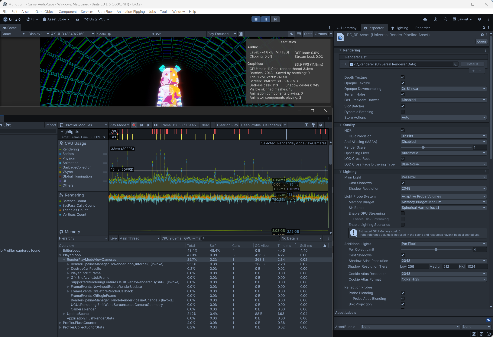
> Batching이 3000을 돌파하며 상당한 성능을 소모하는 상태.
> 
> **Resident Drawer 활성화 상태**  
> 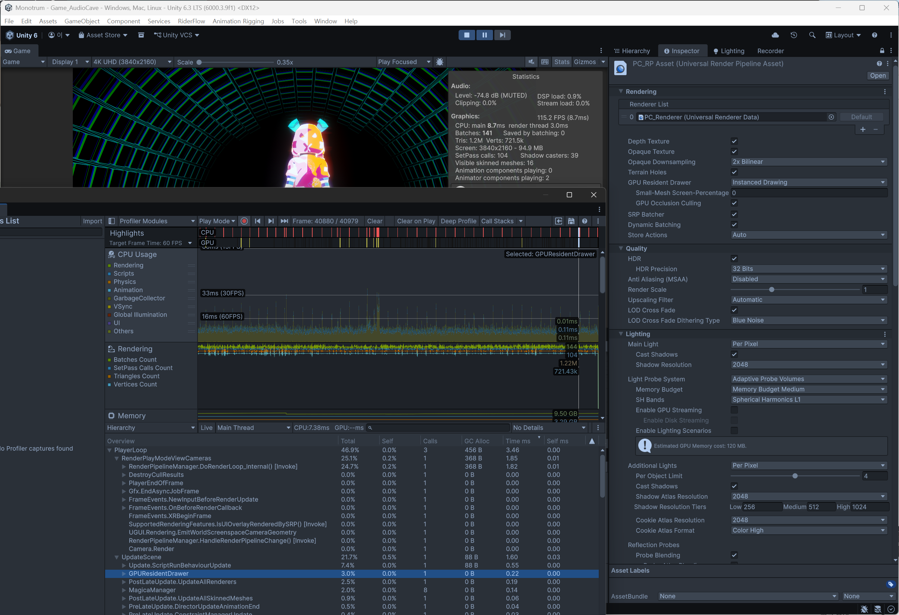
> 140대 배칭으로 안정적인 성능 유지  
> 렌더링 부분에서 상당한 성능을 절약했다.

---

## 9. 옵저버 패턴 기반 이벤트 아키텍처

플래그 변수를 소비하는 방식에서 벗어나 확장성 및 편의성에서 강점을 가지는 이벤트 기반으로 전환했다.

### 9-1. 폴링 → 이벤트 전환

| 이전 (폴링) | 이후 (이벤트) |
|-------------|--------------|
| `if (InputManager.Instance.ConsumeCancel())` | `InputManager.OnCancelAction += TogglePause` |
| `if (AudioManager.Instance.IsPlaying)` | `AudioManager.OnPlayStateChanged += SetAnalyzeState` |
| 매 프레임 상태 확인 | 상태 변경 시점에만 발생 |

### 9-2. AudioAnalyzer의 옵저버 구현

```csharp
private void OnEnable()
{
    AudioManager.Instance.OnPlayStateChanged += SetAnalyzeState;
    _isAnalyzing = AudioManager.Instance.IsPlaying; // 이미 재생 중일 때 동기화
}

private void SetAnalyzeState(bool isPlaying)
{
    _isAnalyzing = isPlaying; // 방송 내용에 따라 자체 상태 변경
}

void Update()
{
    if (_isAnalyzing) // 매니저에게 물어보지 않고 자기 변수만 체크
    {
        AudioManager.Instance.GetSpectrumData(_samples);
        // ...
    }
}
```

**OnPlayStateChanged 방송 누락 버그:** 일시정지(Pause)나 클리어 시 `Time.timeScale = 0`이 적용되어 시각적으로는 완벽하게 멈춘 것처럼 보이지만, AudioManager에서 `OnPlayStateChanged`를 쏘지 않으면 AudioAnalyzer가 여전히 `_isAnalyzing = true` 상태로 매 프레임 `GetSpectrumData`를 허공에 대고 호출하는 '연산 누수'가 발생한다. Pause/Resume/Stop 모든 경로에 `OnPlayStateChanged?.Invoke(bool)` 추가로 해결.

---

## 10. 씬 전환 흐름 및 생명주기 안전 처리
 
UI 전반은 빠른 작업을 위하여 직접 제작하기보다는 Modern UI Pack을 사용하고 해당 에셋의 인스펙터 이벤트 및 스크립팅을 활용했다.
 
> **UI 연출**
> - **타이틀 UI**
> 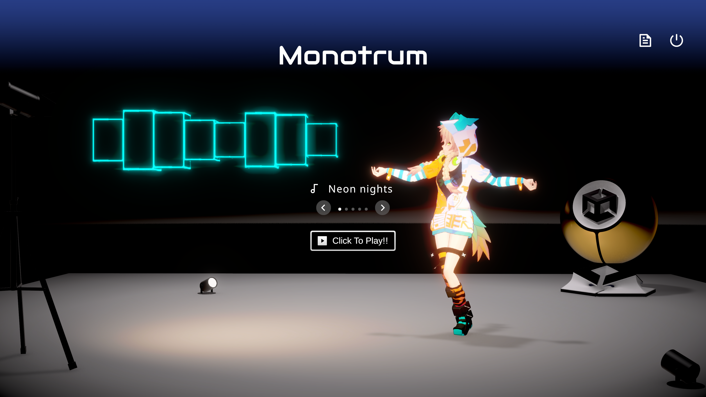
> - **곡 선택 셀렉터**
> 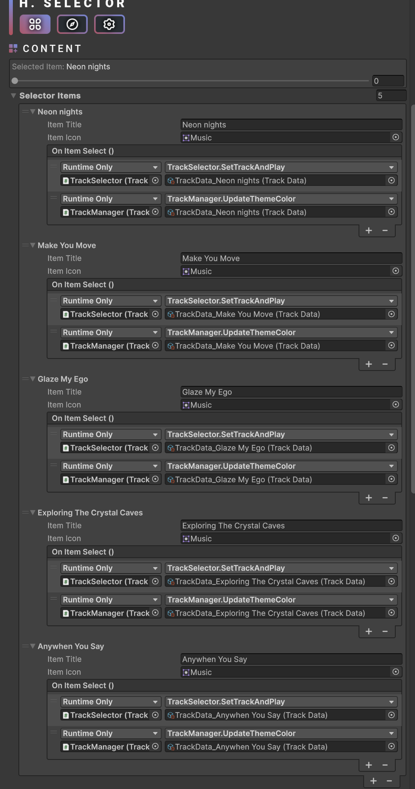
>
> 곡 선택 셀렉터 UI는 해당 셀렉터 에셋의 값이 변하는 이벤트에 값 변화시 선택 트랙을 변화시키고 미리보기 비주얼라이징과 곡 재생을 해준다.
> - **게임 HUD 프로그레스 바**
> 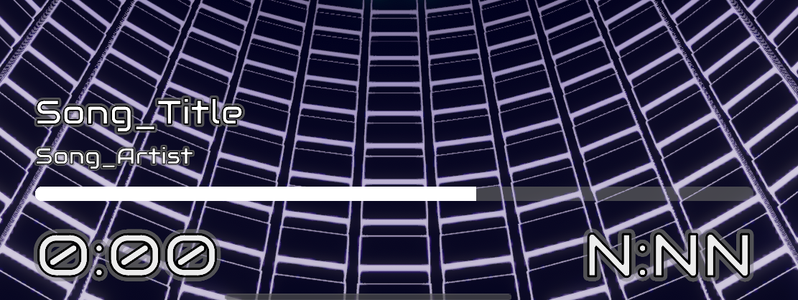
>
> 하단에 프로그레스 바로 곡의 재생 시간 및 곡 정보(곡명, 아티스트)를 표시한다. 텍스트 갱신은 GC 방지를 위해 0.5초 주기로 제한하되, fillAmount는 매 프레임 갱신하여 시각적 부드러움을 확보했다.
> - **일시정지 UI**
> 
>
> ESC 입력 시 `Time.timeScale = 0`으로 게임을 정지하고, Modern UI Pack의 ModalWindowManager를 통해 타이틀 복귀 여부를 묻는 모달을 표시한다.
> - **클리어 UI**
> 
>
> 곡 재생이 끝나면 클리어 판정 후 모달을 표시한다. 타이틀 복귀 시 `CompleteMixerReset` → `InputManager.SetInputActive(false)` → `SceneLoader.LoadTitleScene()` 순서로 안전하게 정리한다.

### 10-0. 씬 전환 플로우

타이틀 씬 ↔ 게임 씬 간의 전체 흐름과 일시정지/클리어 분기를 표현한다.

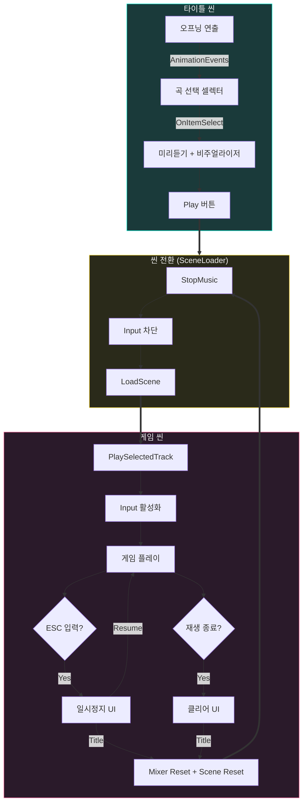
```mermaid
flowchart TD
    subgraph Title["타이틀 씬"]
        direction TB
        OPEN[오프닝 연출]
        SELECT[곡 선택 셀렉터]
        PREVIEW[미리듣기 + 비주얼라이저]
        PLAY[Play 버튼]

        OPEN -->|AnimationEvents| SELECT
        SELECT -->|OnItemSelect| PREVIEW
        PREVIEW --> PLAY
    end

    subgraph Transit["씬 전환 (SceneLoader)"]
        direction TB
        STOP[StopMusic]
        INPUT_OFF[Input 차단]
        LOAD[LoadScene]

        STOP --> INPUT_OFF --> LOAD
    end

    subgraph Game["게임 씬"]
        direction TB
        INIT[PlaySelectedTrack]
        INPUT_ON[Input 활성화]
        RUN[게임 플레이]

        PAUSE{ESC 입력?}
        CLEAR{재생 종료?}

        PAUSE_UI[일시정지 UI]
        CLEAR_UI[클리어 UI]
        RESET[Mixer Reset + Scene Reset]

        INIT --> INPUT_ON --> RUN
        RUN --> PAUSE & CLEAR

        PAUSE -->|Yes| PAUSE_UI
        CLEAR -->|Yes| CLEAR_UI

        PAUSE_UI -->|Resume| RUN
        PAUSE_UI -->|Title| RESET
        CLEAR_UI -->|Title| RESET
    end

    PLAY ==> Transit
    LOAD ==> INIT
    RESET ==> STOP

    style Title fill:#1A3A3A,stroke:#00E5CC,color:#F0F0F0
    style Transit fill:#2A2A1A,stroke:#FFD93D,color:#F0F0F0
    style Game fill:#2A1A2A,stroke:#FF6B9D,color:#F0F0F0
```

### 10-1. 싱글톤 자식 오브젝트 소실 버그

**현상:** 타이틀 씬 → 게임 씬 전환 시 AudioManager가 파괴됨.

**원인 분석:**

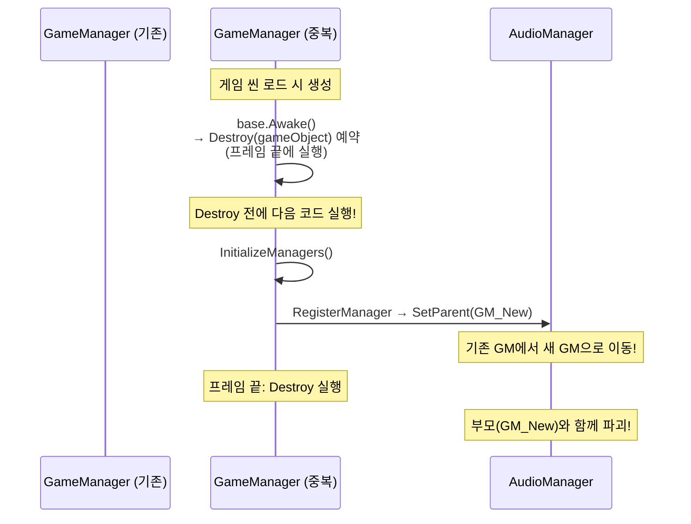
```mermaid
sequenceDiagram
    participant GM_Old as GameManager (기존)
    participant GM_New as GameManager (중복)
    participant AM as AudioManager

    Note over GM_New: 게임 씬 로드 시 생성
    GM_New->>GM_New: base.Awake()<br/>→ Destroy(gameObject) 예약<br/>(프레임 끝에 실행)
    Note over GM_New: Destroy 전에 다음 코드 실행!
    GM_New->>GM_New: InitializeManagers()
    GM_New->>AM: RegisterManager → SetParent(GM_New)
    Note over AM: 기존 GM에서 새 GM으로 이동!
    Note over GM_New: 프레임 끝: Destroy 실행
    Note over AM: 부모(GM_New)와 함께 파괴!
```

**수정:**

```csharp
protected override void Awake()
{
    base.Awake();
    if (Instance != this) return; // 중복이면 초기화 건너뛰기
    InitializeManagers();
}
```

**교훈:** `Destroy()`는 즉시 실행되지 않으므로, 중복 인스턴스에서도 Awake의 나머지 코드가 실행될 수 있다. 싱글톤 패턴에서 초기화 로직은 반드시 중복 체크 이후에 배치해야 한다.

### 10-2. Race Condition (믹서 '막타' 버그)

**현상:** 씬 초기화 중 PlayerController의 Update가 뒤늦게 실행되어, `AudioManager.SetPitch(0f)`를 호출해 기껏 초기화한 믹서를 다시 테이프 스톱 상태로 오염시킴.

**수정:** `_isMixerLocked` 플래그 도입. 초기화 시작 시 잠금 → 새 곡 재생(`PlayTrack`) 시 해제.

```csharp
public void SetPitch(float ratio)
{
    if (_audioMixer == null || _isMixerLocked) return; // 잠겨있으면 무시
    // ...
}
```

### 10-3. 앱 종료 시 이벤트 해제 안전 처리

앱 종료 과정에서 싱글톤 파괴 순서가 보장되지 않아, 이미 파괴된 인스턴스에 접근하면서 경고 로그가 발생하는 문제를 `IsQuitting` 플래그로 해결.

```csharp
private void OnDestroy()
{
    if (Singleton<InputManager>.IsQuitting) return; // 종료 중이면 해제 스킵
    InputManager.Instance.OnJumpAction -= TriggerJump;
}
```

---

## 11. 성능 최적화 종합

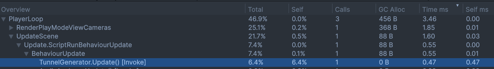

### 11-1. 최적화 전략 요약

| 영역 | 전략 | 결과 |
|------|------|------|
| 터널 오브젝트 | Queue 기반 제네릭 오브젝트 풀 | GC Alloc 0B |
| 머티리얼 | sharedMaterial.SetColor | SRP Batcher 유지 (135 Batches) |
| UI 텍스트 | string.Format 호출 0.5초 주기 제한 | GC 스파이크 방지 |
| UI 프로그레스 바 | fillAmount는 매 프레임 유지 | 시각적 부드러움 확보 |
| 포스트 프로세싱 | 게임 로직을 가볍게 만들어 GPU 예산 확보 | Bloom + 아나모픽 + 비네팅 + 색수차 전부 적용 |
| 오디오 분석 | 옵저버 패턴으로 미재생 시 분석 차단 | 불필요한 FFT 연산 제거 |
| 프레임 제한 | VSync 해제 + 144fps 고정 | 인풋렉 방지 + GPU 과부하 방지 |
| GPU Resident Drawer | GPU 측 드로우 콜 생성 + Occlusion Culling | CPU 렌더링 부하 절감 |

### 11-2. 핵심 수식 총정리

| 시스템 | 수식 | 용도 |
|--------|------|------|
| SpeedRatio | `_currentSpeed / _maxRunSpeed` | 전체 시스템 동기화 비율 |
| 에미션 | `Lerp(min, 1+pulse, ratio)` | 테이프 스톱 + 오디오 반응 결합 |
| FOV | `2·atan(h/2f)·Rad2Deg` | 물리 렌즈 → 수직 FOV |
| 임펄스 | `pulse × mult × ratio` | 킥 비트 기반 카메라 진동 |
| 스냅샷 | `[ratio, 1-ratio]` | Normal ↔ TapeStop 보간 |
| 호 길이 | `2πr / N` | 터널 큐브 자동 크기 계산 |
| 원형 배치 | `(cos(θ)·r, sin(θ)·r, 0)` | 큐브 방사형 좌표 산출 |
| 밴드 압축 | `2^i × 2` | 지수적 주파수 밴드 할당 |
| 감쇠 | `decrease × 1.2` | 가속 하강 곡선 |
| 색수차 | `Clamp(pulse × max, 0, 0.1)` | 킥 순간 색수차 |
