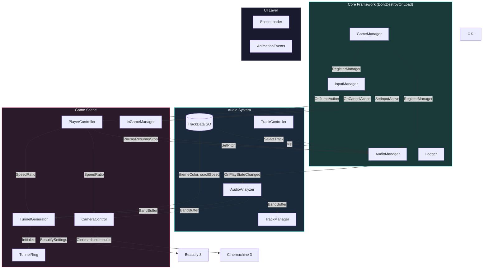
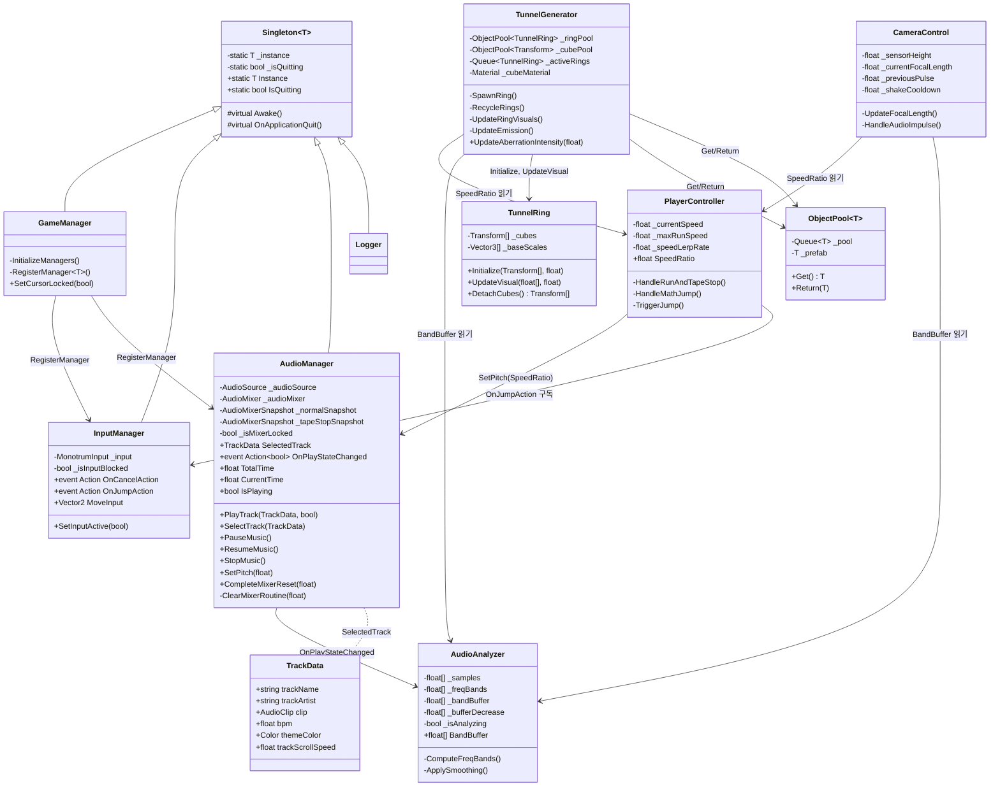
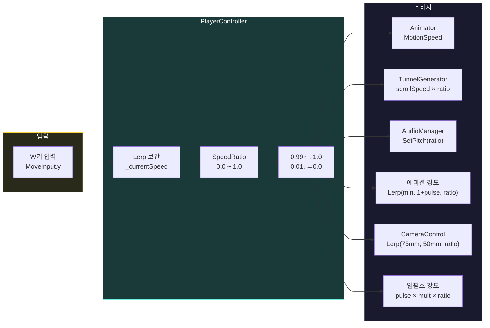
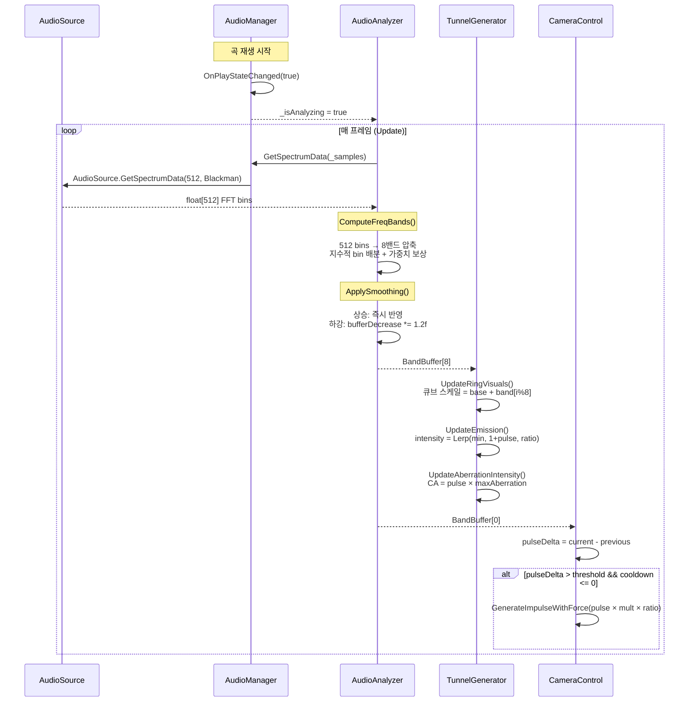
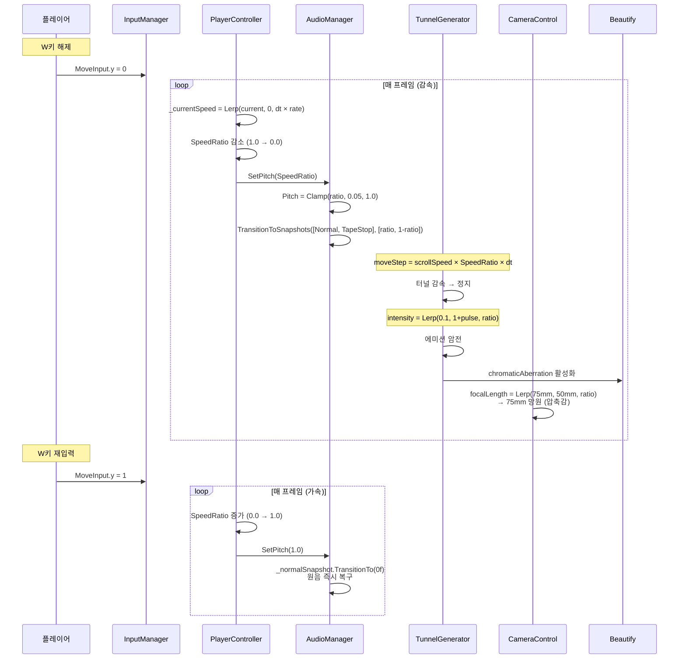
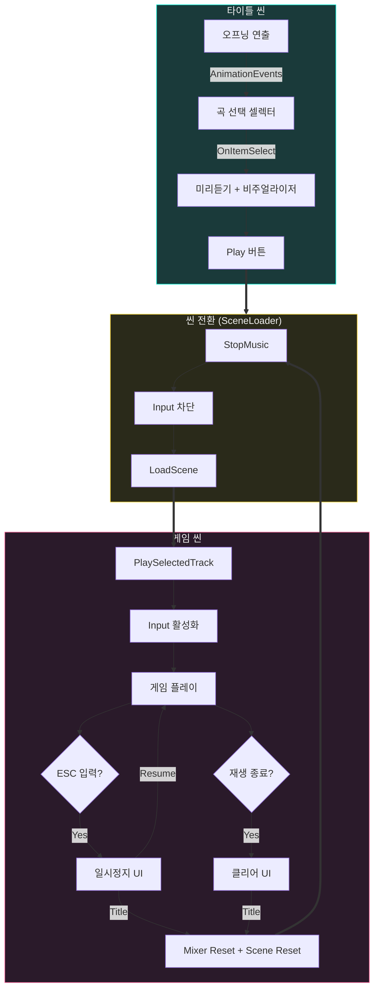
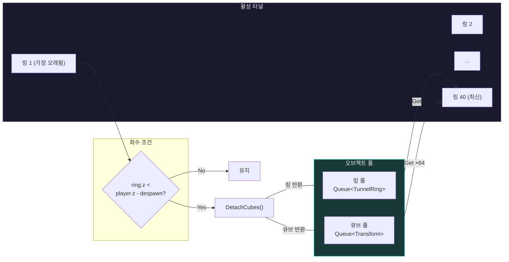
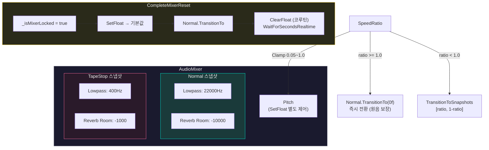

# Monotrum 기술정리 문서

**작성자**: 이성규  
**게임명**: Monotrum (모노트럼)  
**개발 환경**: Unity 6 LTS / C# / URP / Cinemachine 3 / Beautify 3

## 개요

프로젝트의 핵심 시스템 설계, 클래스 간 관계, 데이터 흐름을 정리한 기술 문서.

---

## 1. 시스템 아키텍처 전체도

---

## 2. 클래스 다이어그램

---

## 3. SpeedRatio 데이터 플로우

게임의 핵심 제어 구조. 하나의 정규화 비율로 전체 시스템을 동기화한다.

---

## 4. FFT 오디오 파이프라인

---

## 5. 테이프 스톱 연출 시퀀스

---

## 6. 씬 전환 흐름

---

## 7. 오브젝트 풀링 & 터널 순환

---

## 8. AudioMixer 스냅샷 구조

---

## 9. 핵심 수식 정리

| 시스템 | 수식 | 설명 |
|--------|------|------|
| **SpeedRatio** | `_currentSpeed / _maxRunSpeed` | 0.0~1.0 정규화, 0.99↑→1.0 / 0.01↓→0.0 스냅 |
| **에미션 강도** | `Lerp(minEmission, 1 + audioPulse, SpeedRatio)` | ratio 1: themeColor + 맥박, ratio 0: 10%까지 암전 |
| **FOV 변환** | `2 × atan(sensorHeight / (2 × focalLength)) × Rad2Deg` | 물리 카메라 센서(24mm) + 초점거리(50~75mm) → 수직 FOV |
| **임펄스 강도** | `currentPulse × multiplier × SpeedRatio` | Delta 감지(pulseDelta > threshold) 시에만 발동 |
| **스냅샷 보간** | `TransitionToSnapshots([Normal, TapeStop], [ratio, 1-ratio], dt)` | Pitch는 SetFloat 별도 제어 (충돌 방지) |
| **호 길이** | `2πr / cubesPerRing` | 터널 반지름과 큐브 수로 빈틈 없는 크기 자동 계산 |
| **원형 배치** | `(Cos(θ)×r, Sin(θ)×r, 0)` | θ = (360° / 큐브 수) × i × Deg2Rad |
| **스무딩 감쇠** | `bandBuffer -= bufferDecrease; bufferDecrease *= 1.2` | 매 프레임 가속 감쇠 → 자연스러운 하강 곡선 |
| **색수차** | `Clamp(audioPulse × maxChromaticAberration, 0, 0.1)` | 킥 순간만 색수차 발생 |

---

## 10. 해결한 주요 버그

| 버그 | 원인 | 해결 |
|------|------|------|
| 싱글톤 자식 소실 | Destroy 지연 실행 중 InitializeManagers가 reparent | `if (Instance != this) return` 가드 추가 |
| 믹서 스냅샷 미복구 | SetFloat가 스냅샷 통제를 탈취 | ClearFloat 코루틴으로 오버라이드 해제 |
| 코루틴 정지 | Time.timeScale 0에서 WaitForSeconds 무한 대기 | WaitForSecondsRealtime으로 교체 |
| 믹서 막타 오염 | 초기화 중 PlayerController.Update 잔존 실행 | _isMixerLocked 플래그로 원천 차단 |
| nextSpawnZ 이격 | 링 이동량과 스폰 좌표 미동기 | moveStep만큼 nextSpawnZ도 감산 |
| 스케일 덮어쓰기 | UpdateVisual에서 Vector3.one × scale | _baseScales 보존 후 방사 방향만 가산 |
| SetGlobalColor 무반응 | SRP Batcher CBUFFER가 글로벌보다 우선 | sharedMaterial.SetColor로 직접 갱신 |
| ResumeMusic 처음 재생 | Play()가 처음부터 재생 | UnPause()로 교체 |

---

## 11. 성능 지표

| 항목 | 수치 | 비고 |
|------|------|------|
| 4K FPS | 100+ | 포스트 프로세싱(Bloom, 아나모픽, 비네팅, 색수차) 전부 포함 |
| GC Alloc | 0B | TunnelGenerator.Update 기준 |
| 활성 오브젝트 | 2,560 | 64큐브 × 40링 |
| Batches | 135 | SRP Batcher 유지 (sharedMaterial 방식) |
| CPU Main | 13.8ms | 에디터 기준 (빌드 시 더 낮음) |