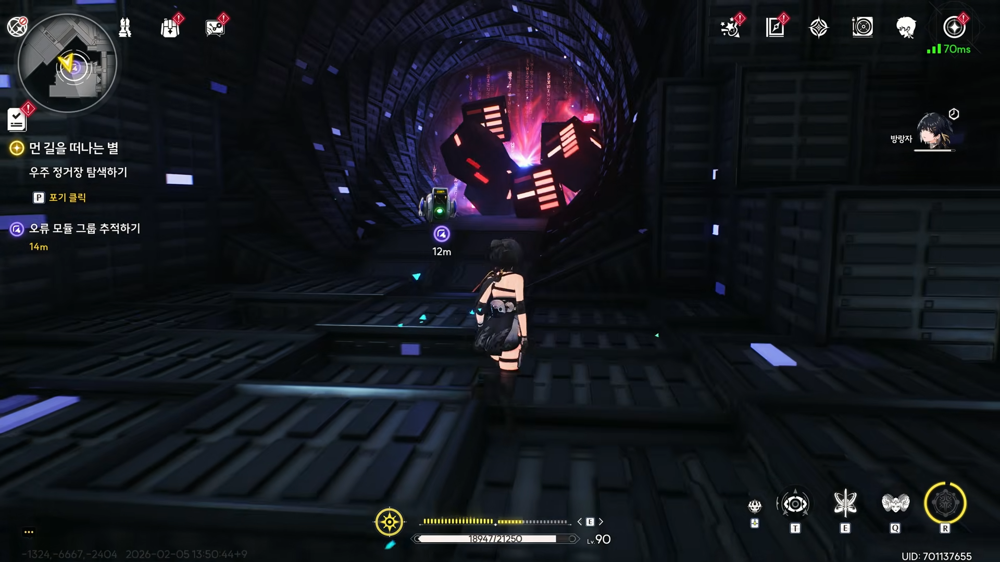
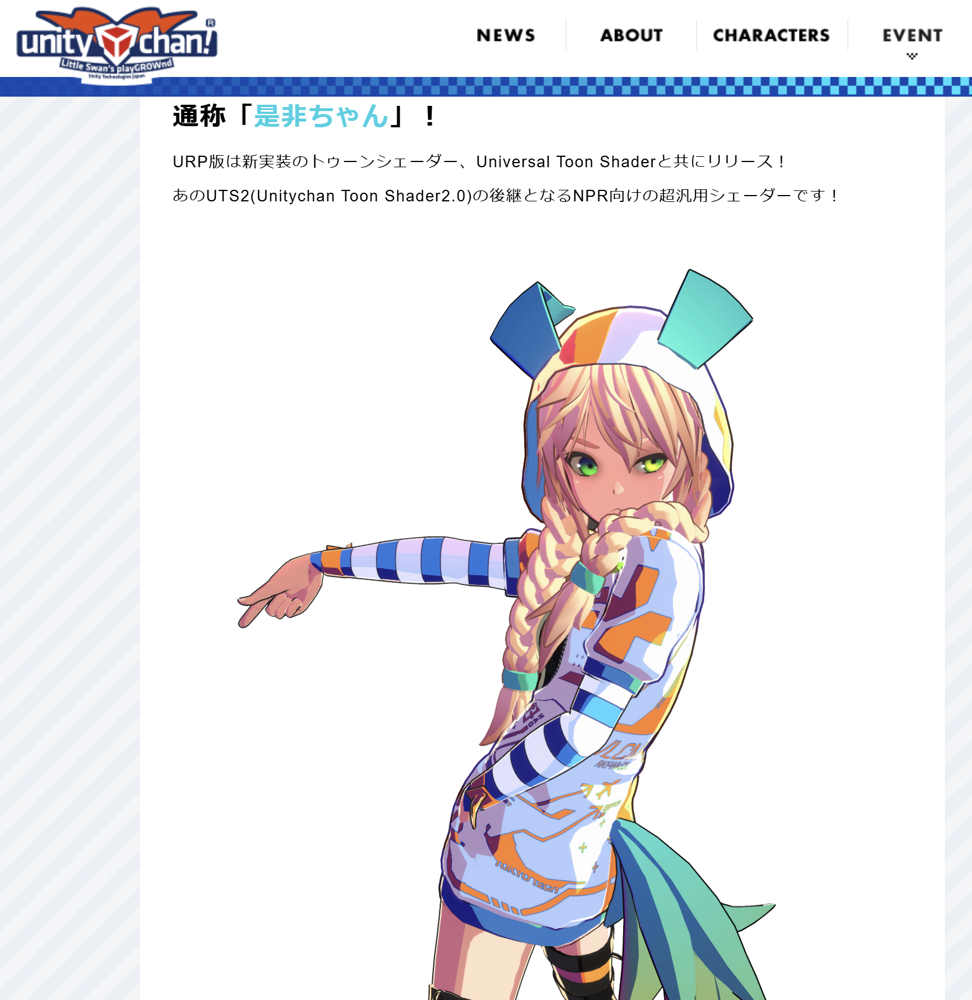
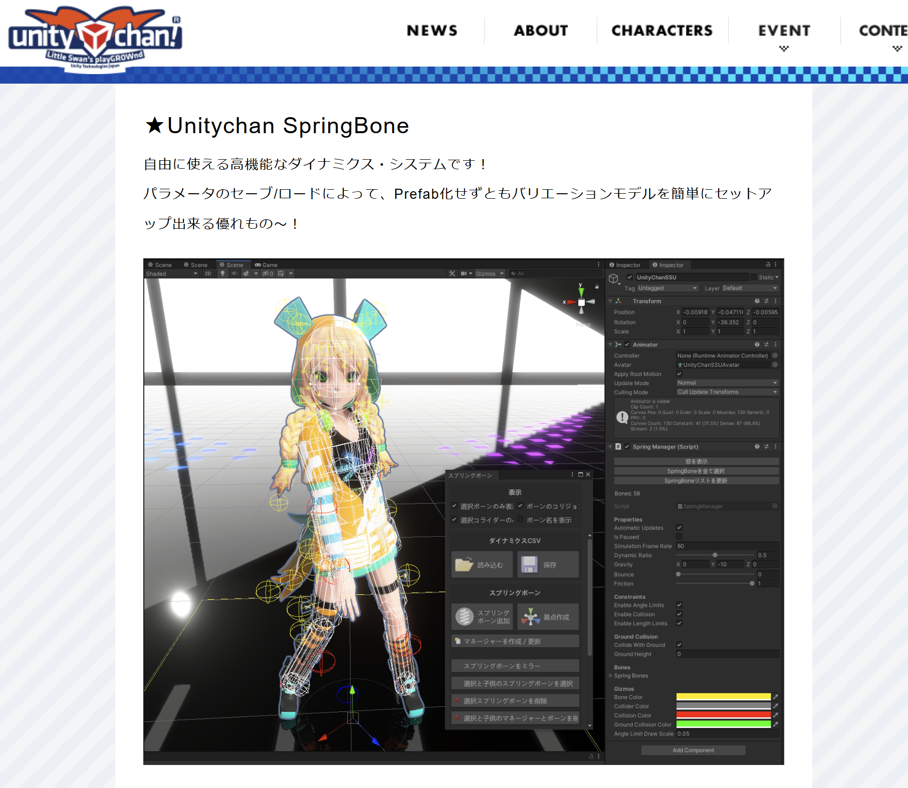

# Project Monotrum (모노트럼) 기획서
작성자: 이성규

## 1. 게임 개요

- 게임명: Monotrum (모노트럼) 
- **장르**: 3D 오디오 리액티브 런 액션 (Audio-Reactive Run Action)
- **플랫폼**: PC (Unity URP)
- **핵심 목표**: 음악의 파형(Waveform)이 실시간으로 지형이 되는 세계에서, 청각과 시각적 경험이 어울러지는 공간을 체험할 수 있는 게임의 제작.
  - 리듬게임의 어려움을 배제한 체험형 음악과 시각적 경험을 동시 제공

---

레퍼런스 경험 명조(동적 맵 생성)
https://www.youtube.com/watch?v=u_k2H_MSZaQ&t=4447s

오디오 비주얼라이저를 게임으로 만든 느낌

## 2. 아트 및 비주얼 컨셉

### 배경 톤앤매너
무색 무음의 흑백(Monochrome)의 큐브로 이루어진 공간을 빛과 음악이 채워나가며 큐브들이 반응한다.

### 포인트 컬러
음악 비트에 반응하여 명멸하는 형광 사이안(Cyan) 계열 색상의 에미션(Emission) 라이팅을 적용한다.

### 캐릭터 컨셉
풀 컬러 카툰 렌더링(Toon Shading)이 적용된 서브컬처 스타일 캐릭터를 사용한다. 무채색 배경 속에서 유일하게 색채를 띠게 하여 시각적 집중도를 높인다. 캐릭터 전진 시 발끝에 빛 궤적(Trail)을 생성한다.

### 캐릭터 에셋
유니티 Japan 공식 제공 `Unity-Chan_Sunny Side Up`을 사용한다. 툰 셰이더가 기본 포함되어 있어 별도의 셰이더 및 추가 작업 없이 아트 컨셉에 부합하는 비주얼의 캐릭터를 확보할 수 있다.

---

## 3. 핵심 게임플레이 (Core Mechanics)

### A. 절차적 오디오 지형 생성 (Audio-Driven Terrain)

맵은 미리 제작되어 있지 않으며, 재생되는 음악의 주파수 데이터(FFT)를 분석해 플레이어 전방에 실시간으로 트랙이 생성된다.

- **저음(Bass) 강조 구간**: 큐브들이 높게 솟아오르며 가파른 오르막 비탈길을 형성.
- **고음 및 잔잔한 구간**: 지형이 낮아지며 평지나 완만한 내리막길을 형성.

플레이어는 이 굽이치는 '소리의 궤적'을 따라 끊임없이 전진하며 롤러코스터와 같은 동선을 그린다.

### B. 조작 체계 및 시간 제어 (Time Control)

#### 기본 조작
| 입력 | 동작 |
|------|------|
| W (유지) | 전진 |
| Space | 점프 |

#### 테이프 멈춤 효과 (Tape Stop)
전진 키(W) 입력 해제 시, 캐릭터가 멈춤과 동시에 재생 중인 음악의 피치(Pitch)가 0으로 서서히 떨어진다.

#### 정지 시각 연출
조작이 멈추면 화면 전체가 흑백으로 짙어지고, 큐브들의 형광 라이팅이 소등되며 세상의 시간이 멈춘 듯한 적막감을 연출한다. 다시 전진 시 세상이 다시 움직이듯 소리와 색상이 복구된다.

### C. 클라이맥스 중력 반전 (QTE)

음악의 하이라이트 구간 진입 직전, 화면 줌인 및 글리치(Glitch) 효과와 함께 특정 UI 아이콘이 출력되며 시각적 예고가 진행된다.

정확한 타이밍에 입력 성공 시, 월드의 중력 좌표계가 180도 반전된다. 카메라가 함께 180도 회전하며, 캐릭터는 허공을 지나 천장에 생성된 트랙으로 무사히 착지하여 질주를 이어간다.

---

## 4. 레벨 및 환경 디자인

### 터널 구조
중앙의 메인 질주 트랙을 감싸는 형태로, 수백 개의 큐브들이 나선형(Spiral)으로 배치된 거대한 동굴 형태로 구성한다.

### 시각적 반응
메인 트랙을 제외한 배경 큐브들은 물리 충돌 판정이 없으며, 오디오 비트에 맞춰 크기가 유동적으로 팽창/수축하여 공간 자체가 살아 숨 쉬는 듯한 몰입감 높은 체험을 제공한다.

---

## 5. 시스템 및 로직 설계 (System Architecture)

### 물리 엔진 최적화 (No-Rigidbody)
캐릭터 점프 및 낙하 시 유니티 내장 물리 엔진을 배제한다. 현재 Z축 좌표에 매핑된 수학적 지형 높이값을 참조하여 캐릭터의 Y축 위치를 직접 동기화하는 Kinematic 제어 방식을 채택한다.

### 오브젝트 풀링 (Object Pooling)
지형 및 배경을 이루는 수백 개의 큐브는 런타임에 파괴되지 않는다. 플레이어 시야 밖으로 벗어난 큐브는 큐(Queue) 자료구조를 통해 회수된 후, 전방 트랙 생성 지점으로 재배치되어 메모리 낭비를 원천 차단한다.

### 오디오 분석 파이프라인
`AudioSource.GetSpectrumData`를 통해 FFT 주파수 데이터를 실시간 추출하고, 주파수 밴드별 스무딩 처리를 거쳐 지형 높이값과 배경 큐브 스케일에 매핑한다.

### Unity 6 GPU Resident Drawer
동적인 큐브 배경을 처리하기 위해 Unity 6의 GPU Resident Drawer를 활성화하여 CPU 부하를 낮춘다.

---

## 6. 플레이 흐름

### 도입
고요한 흑백 터널 속, 잔잔한 음악과 함께 평탄한 트랙을 질주한다.

### 전개
비트가 강해지며 트랙이 오르막/내리막으로 요동치고, 좌우 벽면의 큐브들이 음악에 맞춰 강렬하게 명멸한다.

### 절정
클라이맥스 진입 → 중력 반전 QTE 성공 → 시야가 뒤집히며 천장 트랙을 질주하는 역동적 카타르시스를 체감한다.

---

## 7. 개발 일정

사전 준비(프로젝트 세팅, 유니티짱 임포트, 문서 작업)를 완료한 상태에서 7일간 핵심 구현을 진행한다.

| Day | 작업 내용 |
|-----|-----------|
| 1 | 오디오 분석 + 트랙 생성 + FFT 스무딩 튜닝 |
| 2 | 캐릭터 Kinematic 이동 + 지형 Y좌표 동기화 |
| 3 | 터널 환경 구축 + 배경 큐브 비트 반응 |
| 4 | 테이프 스톱 (기능 + 연출 풀셋) |
| 5 | 중력 반전 QTE |
| 6 | 연출 폴리싱 (FOV, Trail, 글리치 등) |
| 7 | 통합 테스트 + 빌드 |

### 우선순위

- **필수 구현**: 오디오 지형 생성, 캐릭터 이동, 오브젝트 풀링, 테이프 스톱 연출
- **목표 구현**: 중력 반전 QTE, 나선형 터널 배경
- **보너스**: 글리치 셰이더, 트레일 이펙트, FOV 속도감 연출

---

## 8. 기술 스택

- **엔진**: Unity (URP)
  - **유니티 버전**: 6.3 LTS
- **언어**: C#
- **캐릭터**: Unity-Chan 공식 패키지 (ユニティちゃんSunny Side Up)
  - https://unity-chan.com/download/releaseNote.php?id=ssu_urp
- **오디오 분석**: AudioSource.GetSpectrumData (FFT)
- **렌더링**: URP Post Processing (Bloom, Vignette, Color Adjustments)
- **물리 방식**: Kinematic Y좌표 직접 제어 (No-Rigidbody)
- **최적화**: Queue 기반 오브젝트 풀링

---

**작성일**: 2026-02-24