# Monotrum_작업 노트

**작성자**: 이성규  
**게임명**: Monotrum (모노트럼)  
**작성일**: 2026-02-24  
**최종 수정**: 2026-03-03

## 프로젝트 개요

- **진행 기간**: 2026.02.26(목)~2026.03.06(금): [6일]
- **개발 환경**: Unity / C#
- **유니티 버전**: 6.3 LTS

### **프로젝트 목표**
1. **오디오 리액티브 지형 생성** — `GetSpectrumData()`와 `FFTWindow`를 활용하여 오디오 스펙트럼 데이터 기반의 실시간 지형 및 비주얼 변경 구현
2. **체험형 오디오 런 액션** — 리듬게임의 난이도 장벽을 배제하고, 음악과 시각 경험을 동시에 제공하는 러닝 액션 게임
3. **대비적 툰쉐이딩 캐릭터** — 무채색 배경 위에 화려한 툰쉐이딩 캐릭터를 배치하여 시각적 대비 효과 극대화
4. **최소 리소스, 최대 비주얼** — 포스트 프로세싱 + 절차적 맵 생성을 통해 최소한의 리소스로 만족스러운 시각적 경험 달성

---

## 에셋 및 리소스 구성

### 비주얼 에셋 (개인 소유 유료)

개인 소유 유료 에셋을 통해 게임 비주얼의 향상에 사용한다.

**Modern UI Pack** — [Asset Store](https://assetstore.unity.com/packages/tools/gui/modern-ui-pack-201717)  
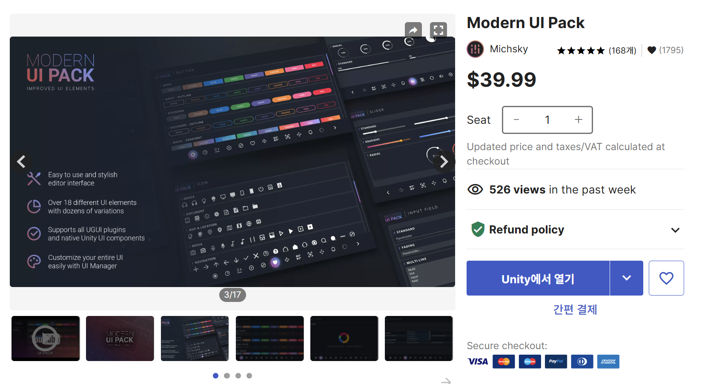
게임 분위기에 맞는 깔끔한 느낌의 UI 에셋 사용

**Beautify 3 - Advanced Post Processing** — [Asset Store](https://assetstore.unity.com/packages/vfx/shaders/fullscreen-camera-effects/beautify-3-advanced-post-processing-233073)
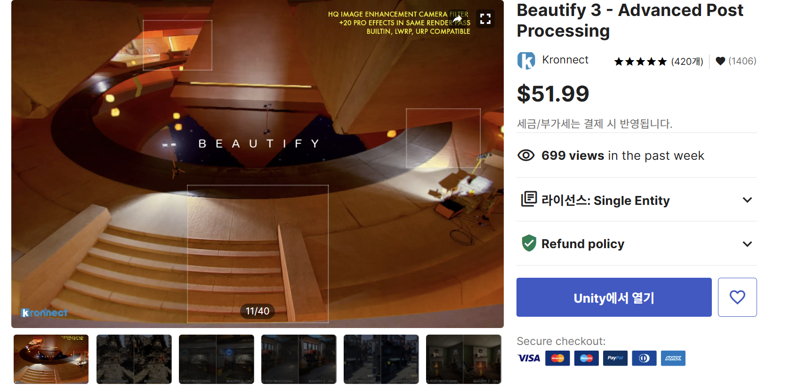
BIRP 및 URP와 호환되는 포스트 프로세싱 에셋으로 기존 유니티 기본 후처리보다 다양하고 퀄리티 높은 후처리 기술을 다수 제공한다.

**LUT Pack for Beautify**
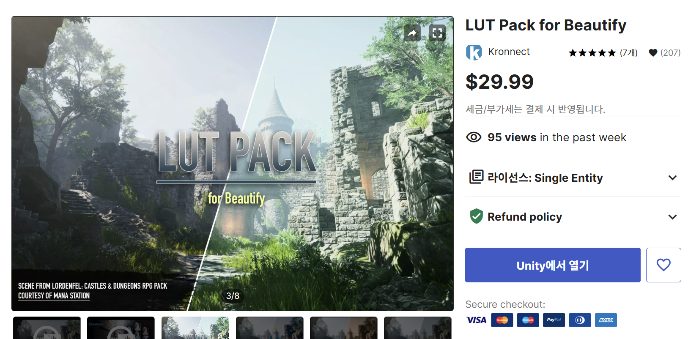 — [Asset Store](https://assetstore.unity.com/packages/vfx/shaders/fullscreen-camera-effects/lut-pack-for-beautify-202502)
Beautify 3를 위해 만들어진 LUT 텍스쳐로 비주얼 개선 및 화면 전체 색상의 일관성을 확보한다.

### 편의성 플러그인

**RiderFlow** — [Asset Store](https://assetstore.unity.com/packages/tools/level-design/riderflow-218574)

에디터 내 코드 확인/수정, 에셋 검색 및 배치, 게임 오브젝트 북마크, 씬뷰 카메라 시점 저장, 하이어라키 커스텀 및 메모 기능 제공

### Unity 패키지

**ProBuilder**: 큐브 이외의 도형이 필요한 경우 사용<br>
**Recorder**: 인게임 스크린샷 및 녹화를 위해서 설치<br>
**TextMeshPro**: UI 표시용으로 필수 설치<br>
**Cinemachine**: 카메라의 동적인 움직임을 위하여 설치

### 음악

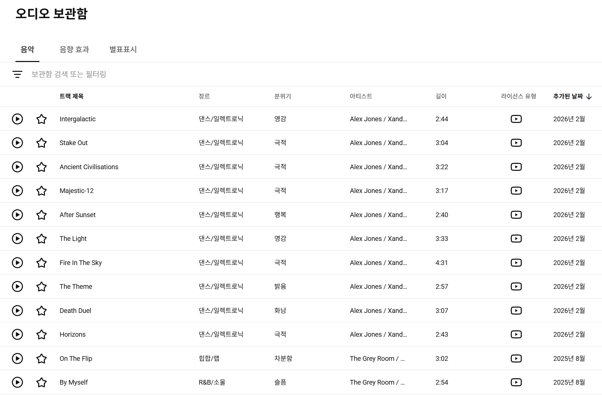

유튜브 오디오 보관함의 로열티 프리 음악을 사용한다. 2차 배포가 금지되어 있으므로 `.gitignore` 처리된 임포트 폴더에 별도 관리한다.

### 폰트

**Google Noto Sans** — https://fonts.google.com/noto  
SIL Open Font License로 배포 허용. 라이선스 파일을 포함하여 커밋 가능.

### 3D 캐릭터

**Unity-Chan (ユニティちゃん Sunny Side Up)**  
다운로드: https://unity-chan.com/download/releaseNote.php?id=ssu_urp

**선정 이유**: 무채색 배경과의 색상 대비 효과가 뛰어나고, 캐릭터의 후드와 신발의 외형이 음악을 들으며 달리는 게임 컨셉에 적합하다.

---

## 작업 일지

### 2026-02-24 (사전 작업)

프로젝트 Monotrum 기획서 작성 및 사용 기술 검토

### Day 1 — 2026-02-26 (작업 시작)

#### 기초 프로젝트 세팅

- Unity 6000.3.9f1 버전으로 URP 3D 프로젝트 생성
- 각종 에셋 및 패키지 임포트
- 폰트 임포트 및 SDF 생성

##### 캐릭터 임포트

캐릭터를 가져오기 전, 다음 패키지를 선행 설치한다

- **Unity Toon Shader** - [매뉴얼](https://docs.unity3d.com/Packages/com.unity.toonshader@0.13/manual/installation.html)
  - `com.unity.toonshader`을 통해 패키지 파일을 설치한다.
- **Unity Chan Spring Bone** - [GitHub](https://github.com/unity3d-jp/UnityChanSpringBone.git#1.2.1-preview)
  - 캐릭터 본 물리 움직임을 담당한다.

#### 캐릭터 가져오기
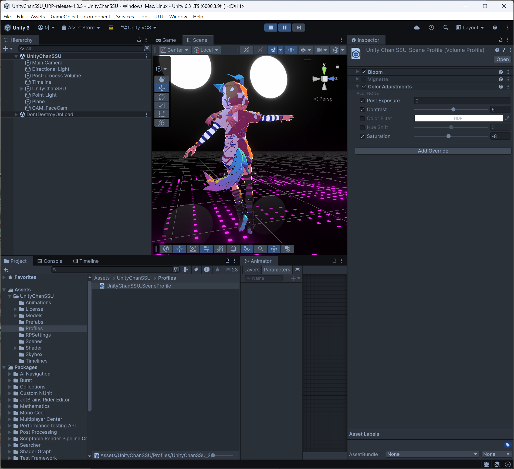
- 다운로드 받은 프로젝트 파일을 연다.
  - 사진과 같이 잘 세팅된 캐릭터를 확인할 수 있다.

- 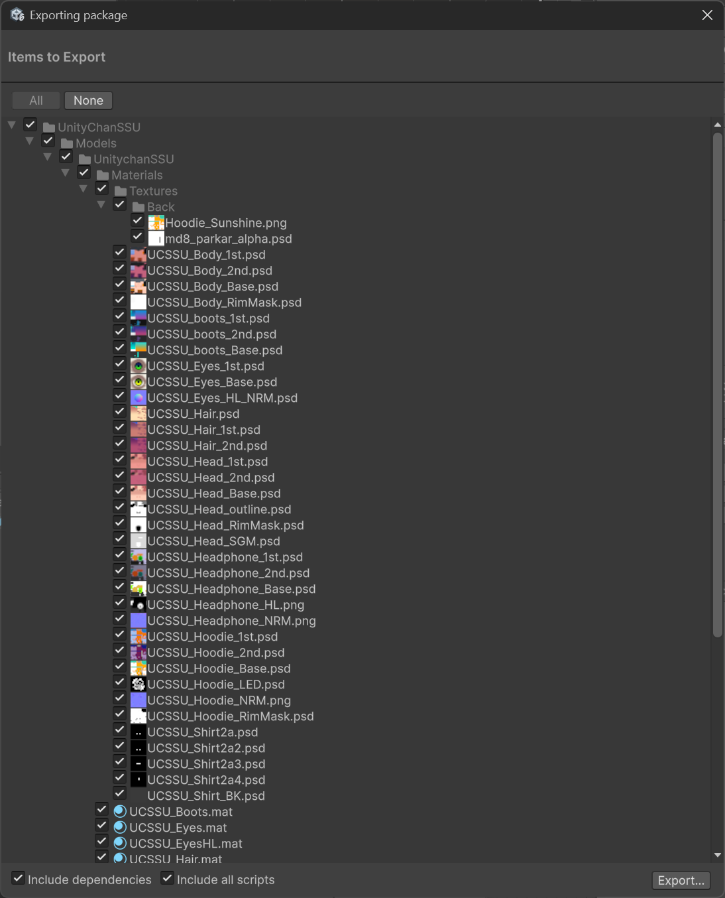
- 다운로드 받은 프로젝트에서 캐릭터만 패키지 파일로 추출하여 작업 프로젝트에 임포트했다

- 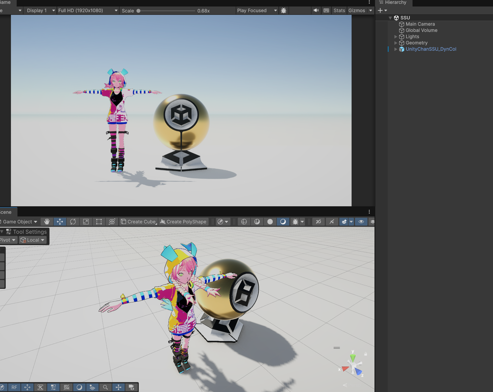
- 가져오는데 성공한 모습

#### 추가 리소스 임포트


**Unity-Chan! Model** 에셋을 추가 임포트하여 부족한 애니메이션 리소스를 보충했다.

다만 해당 에셋의 애니메이션이 개발 방향에 적합하지 않아, **Starter Assets - ThirdPerson** ([Asset Store](https://assetstore.unity.com/packages/essentials/starter-assets-thirdperson-updates-in-new-charactercontroller-pa-196526)) 에셋의 애니메이션을 대신 활용한다.

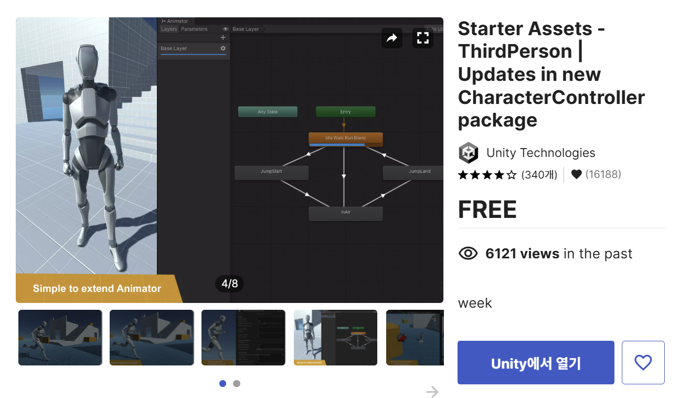

#### 정상동작 확인 및 성능 이슈 확인
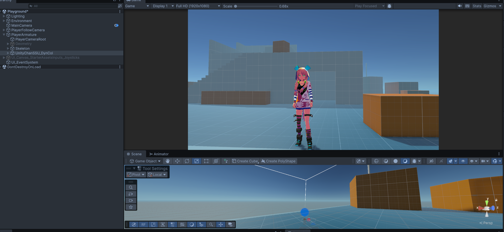
스타터 에셋의 애니메이션이 정상 동작하는걸 확인

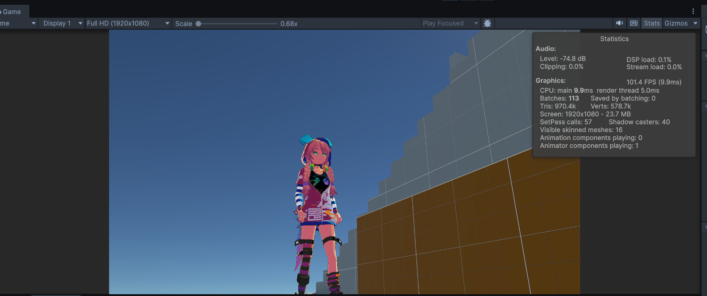
하지만 테스트 중에 프레임이 무거워지거나 끊기는 현상 확인.
프레임이 일정하게 유지 되지 않는다.

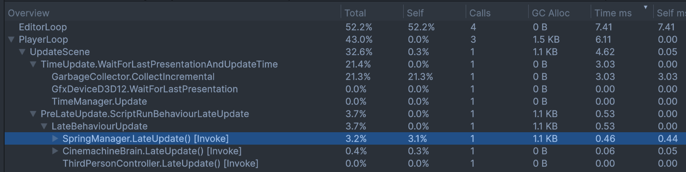
따라서 프로파일러를 확인한 결과 캐릭터의 본을 움직여주는 Spring Bone에서 1.1 KB GC Alloc이 발생하는 성능 이슈를 확인했다.

CPU Main 9.9ms: 스크린샷에서는 CPU 연산 시간이 9.9ms로 렌더 스레드(5.0ms)보다 훨씬 길게 잡히며 그 이유 중 하나가 이 높은 폴리곤 수와 스프링본 연산의 결합 때문일 가능성이 크다.

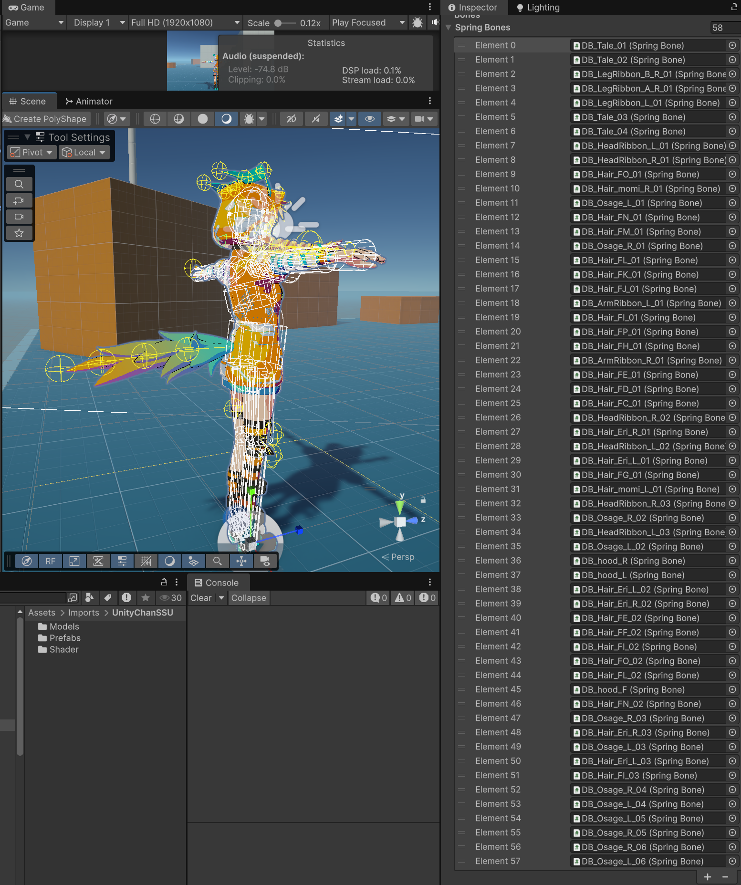
또한 해당 캐릭터는 58개의 스프링본을 처리하는데 있어 성능을 많이 잡아먹는 것을 유추할 수 있었다.

#### 해결 과정

`Unity Chan Spring Bone`은 꽤 옛날에 만들어진 시스템으로 현대에 와서 사용하기엔 성능 이슈가 있을 수 있다. 따라서 쉽고 빠르게 성능 좋은 피직스본을 도입하기 위해 `Magica Cloth 2` 에셋을 도입한다.

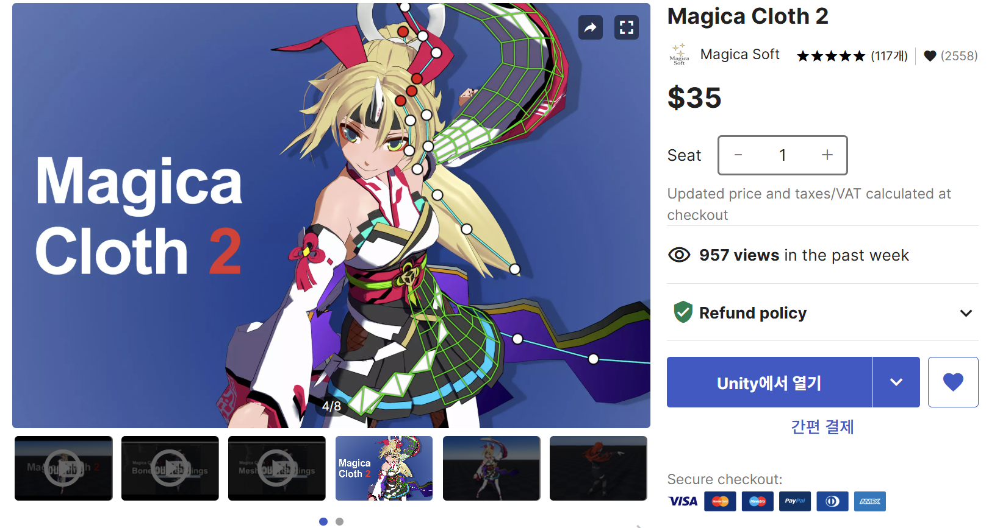
[Magica Cloth 2-AssetStore](https://assetstore.unity.com/packages/tools/physics/magica-cloth-2-242307)

Unity DOTS를 사용해 멀티스레딩을 지원하므로 CPU에 코어(스레드)가 많은 기기일수록 성능 향상 폭이 크다.  
지속적인 업데이트 및 유니티6로 넘어와서 생긴 신기능들에 대한 지원에도 적극적인 에셋이다.

[Magica Cloth 2_성능 분석 포스트](https://wisdom-atelier.tistory.com/m/170)  
[MagicaCloth2-공식문서](https://magicasoft.jp/en/magica-cloth-2-2/)

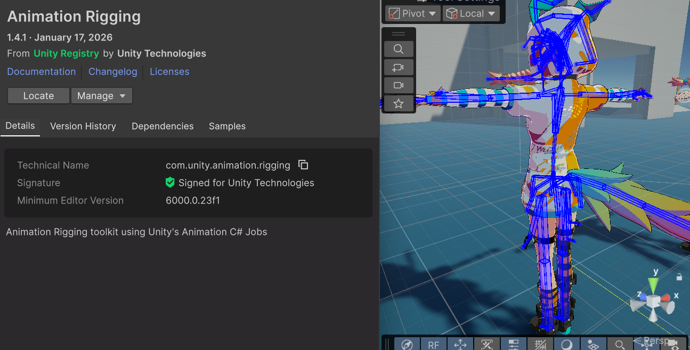
또한 캐릭터의 본을 시각적으로 확인하기 위해 `Animation Rigging` 패키지를 설치했다.

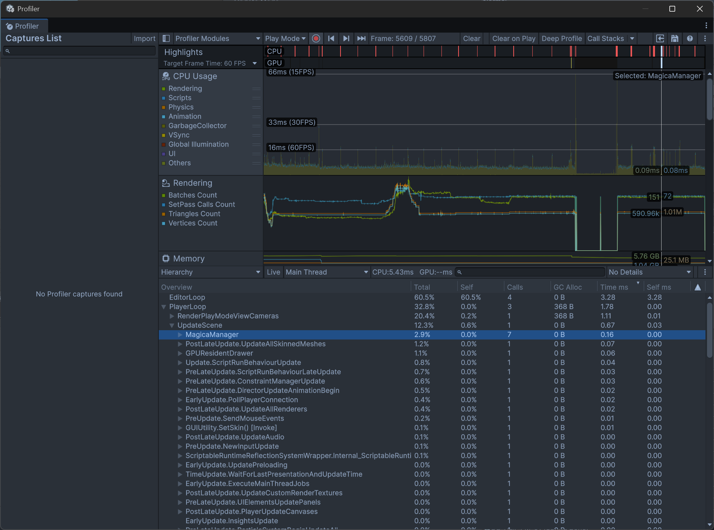

본 교체 작업 도중의 프로파일러 결과이지만, Magica Cloth는 GC Alloc을 일절 발생시키지 않았다.

다만 에디터 차원에서 부하가 커졌는데, 이는 Magica Cloth가 Burst와 Job System을 사용하기 때문이다. 에디터는 이를 실시간으로 모니터링하는 과정에서 추가 부하가 발생하므로, 실제 빌드 대비 에디터상 성능이 더 낮게 측정된다.

상기에서 언급한 Magica Cloth 2 성능 분석 포스트를 보면,

Burst는 에디터에서는 JIT(Just-In-Time) 방식으로, 빌드에서는 AOT(Ahead-of-Time) 방식으로 컴파일된다. 따라서 **Edit → Project Settings → Editor** 탭에 있는 Enter Play Mode Options를 활용하면 반복적인 플레이 작업 시 Burst가 다시 JIT 컴파일되는 것을 방지할 수 있다.


유니티 6에서는 옵션의 이름이 다르며, **Do not reload Domain or Scene**을 선택한다.

기본값인 Reload Domain and Scene은 플레이 버튼을 누를 때마다 유니티가 모든 C# 스크립트 상태를 초기화하고 씬을 다시 읽는다. 이때 Burst 컴파일러도 다시 확인 과정을 거치며 지연이 발생한다.

Do not reload Domain or Scene을 선택하면 도메인 리로드를 건너뛰므로, 플레이 진입 시간이 대폭 단축된다. Magica Cloth 등의 Burst 코드가 메모리에 Warm 상태로 유지되어 매 실행마다 발생하던 JIT 지연도 크게 줄어든다.

> **주의**: Domain Reload를 끄면 `static` 변수가 플레이 모드 진입 시 초기화되지 않는다. `static` 필드를 사용하는 경우 `[RuntimeInitializeOnLoadMethod(RuntimeInitializeLoadType.SubsystemRegistration)]` 등을 통해 수동 초기화 처리가 필요하다.

다만 이번 프로젝트에서는 개발 일정을 고려하여 Reload Domain and Scene 상태를 유지하기로 했다. Domain Reload를 끄면 모든 static 필드의 수동 초기화를 보장해야 하므로, 제한된 일정 내에서 안정성을 우선했다.


> **Warm 상태란?**
> JIT 컴파일 맥락에서 쓰이는 용어로, 이미 컴파일된 네이티브 코드가 메모리에 캐싱되어 즉시 실행 가능한 상태를 말한다.
> - **Cold**: 엔진 가동 직후, 컴파일 안 됨 (느림)
> - **Warm**: 이미 컴파일 완료, 메모리에 상주 (매우 빠름)

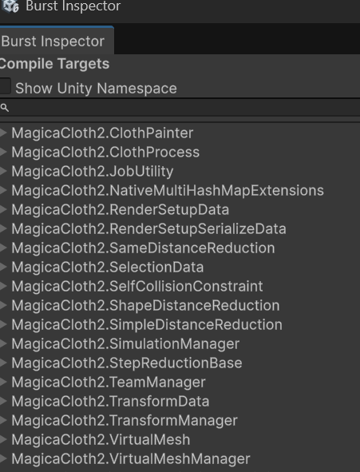

또한 Magica Cloth는 상당히 많은 양의 Job을 사용하므로, 이를 실시간으로 디버깅하면 에디터 부하 및 성능 저하가 크다.

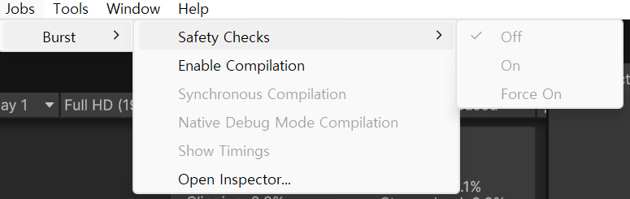

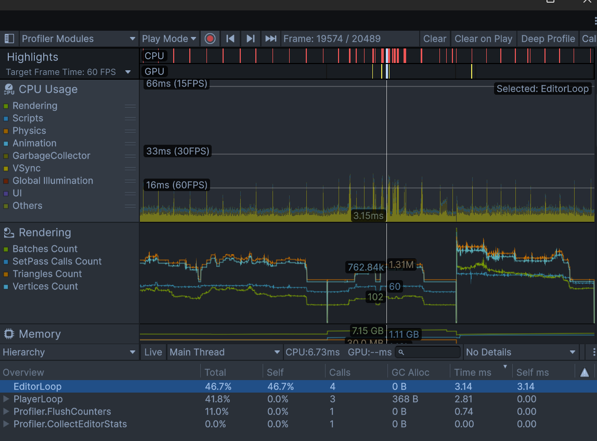

위 이미지와 같이 Burst Job 컴파일을 끄니 에디터 부하가 상당히 감소했다.

### Day 2 — 2026-02-27 (코어 스크립트 작성 & 오디오 분석)

#### 기초 코어 스크립트 작성

개발 편의성을 위해 이전 팀 프로젝트에서 작성한 코어 스크립트를 가져와 편집했다.

**Singleton 스크립트**

제네릭 싱글톤 베이스 클래스로, 모든 매니저의 공통 기반이 된다.

- `_isQuitting` 플래그를 통해 앱 종료 시 싱글톤 재생성을 방지한다. 싱글톤의 파괴 순서는 보장되지 않으므로, 종료 과정에서 다른 오브젝트가 이미 파괴된 싱글톤에 접근하여 다시 생성되는 것을 막기 위함이다.
- `FindFirstObjectByType<T>()`을 사용하여 씬에서 기존 인스턴스를 탐색한다. 싱글톤 특성상 하나만 존재하므로 첫 번째만 찾는 동작이 적합하다.
- `DontDestroyOnLoad`은 루트 오브젝트일 때만 호출하도록 조건을 추가했다. GameManager의 자식으로 배치되는 싱글톤(Logger 등)은 부모의 `DontDestroyOnLoad`을 따라가므로 별도 호출이 불필요하다.
- Awake를 virtual로 선언하여 자식 클래스에서 override할 수 있게 했다. 단, `base.Awake()` 내부에서 인스턴스 등록 및 `DontDestroyOnLoad`이 실행되므로 호출을 누락하면 씬 전환 시 매니저가 삭제된다.
- 런타임 자동 생성 시 `[Singleton] ClassName`으로 네이밍하여 하이어라키 가시성을 확보하고, 씬에 중복 배치된 인스턴스 발견 시 경고 로그 출력 후 자동 삭제한다.

**Logger 스크립트 및 프리팹**

이전 프로젝트에서 작성한 스크립트 및 프리팹을 가져왔다.

- Canvas + TMP를 활용한 오버레이 형태의 프리팹으로, 배경을 반투명 처리하여 게임 플레이를 가리지 않도록 배치했다.
- `Queue<string>` 기반 선입선출 로그 관리로, 최대 라인 수를 초과하면 가장 오래된 로그가 자동 제거된다.
- `string.Join`을 사용하여 큐 내용을 합쳐 UI 텍스트를 갱신한다.
- `Debug.isDebugBuild` 체크를 통해 릴리즈 빌드에서는 동작하지 않도록 방지 처리했다.
- `#if UNITY_EDITOR` + `OnValidate`를 사용하여 에디터에서 인스펙터의 enableDebug 체크박스로 텍스트 표시 여부를 즉시 제어할 수 있다.
- 로그 타입별 색상 구분 (Info: 초록, Warning: 노랑, Error: 빨강) 및 `DateTime` 기반 타임스탬프를 표시한다.

**Define 스크립트 작성**
- 전역적으로 사용하는 상수(Constant) 및 열거형(Enum) 정의.

**GameManager 스크립트 작성**

싱글톤 매니저를 생성(호출)하고 GameManager의 자식으로 등록하는 기능과 커서 잠금/해제 토글 기능이 포함되어 있다.

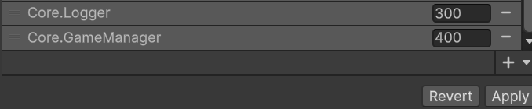

Logger는 UI 캔버스를 포함한 프리팹으로 구성되어 있어 `RegisterManager`를 통한 자동 생성에 적합하지 않다. 따라서 `Script Execution Order`에서 Logger를 GameManager보다 앞으로 설정하여 Logger의 Awake가 먼저 실행되도록 초기화 순서를 보장한다.

씬 수가 많지 않고 비동기 로딩이나 씬 전환 연출 계획이 없으므로, 별도의 Scene관련 스크립트나 매니저를 두지 않고 GameManager에 종료 함수를 추가했다.

**InputManager 스크립트 작성**

InputSystem 기반으로 입력 값을 처리하는 매니저를 작성했다.

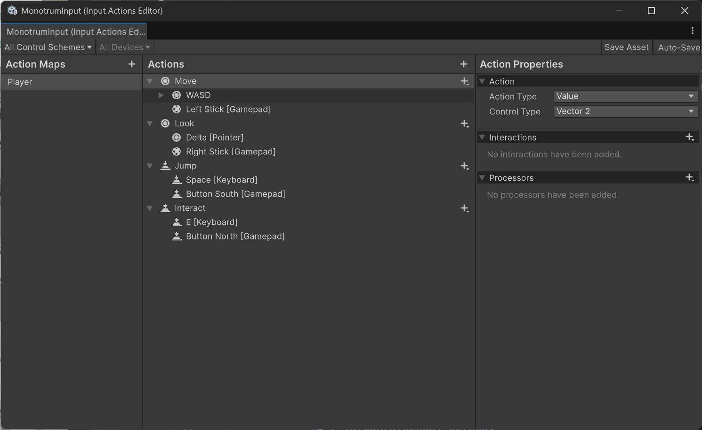
위 이미지와 같이 Input Action Asset을 설정한 뒤, C# 클래스로 생성하여 인스펙터 할당 없이 코드에서 직접 입력 값을 다룰 수 있게 했다.

한 번만 소비되어야 하는 입력(Cancel 등)은 프로퍼티 대신 Consume 함수로 제공하여, 읽는 시점에 자동으로 상태가 초기화되도록 했다.
```cs
public bool ConsumeCancel()
{
    if (_cancelInput)
    {
        _cancelInput = false;
        return true;
    }
    return false;
}
```

#### AudioManager 제작

음원 관리 방식으로 Resources와 Addressables를 검토했으나, 5곡 규모에서 Addressables는 과도하고 Resources는 포트폴리오에서 레거시 인상을 줄 수 있어 ScriptableObject 기반 직접 참조 방식을 선택했다. 오디오 파일은 .gitignore 처리된 Imports 폴더에 유지하고, SO에서 클립을 참조하는 구조로 구현했다.

AudioManager는 BGM/SFX의 로드, 볼륨 조절, 재생/정지만 담당하며, `GetSpectrumData`를 통해 FFT 스펙트럼 원본 데이터를 외부에 제공하는 역할까지만 수행한다.

#### TrackData : ScriptableObject 작성

곡별 정보와 게임플레이에 필요한 정보를 SO로 관리한다.

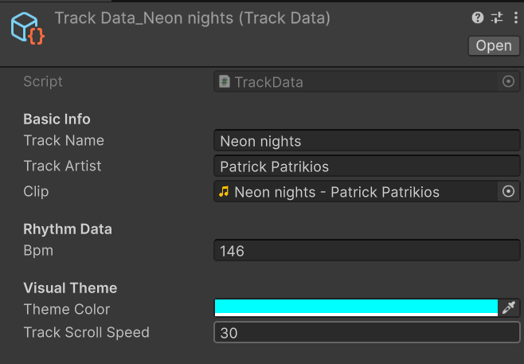

| 필드 | 용도 |
|------|------|
| `trackName` / `trackArtist` | 곡 기본 정보 |
| `clip` | AudioClip 직접 참조 |
| `bpm` | 비트 파악 및 맵 생성 속도 기준값 |
| `themeColor` | 곡 재생 시 큐브/배경에 적용할 메인 컬러 |
| `cubeSpeed` | 큐브 생성/이동 기본 속도 |

#### AudioAnalyzer 스크립트 작성

#### 1단계: FFT 원본 데이터 수집

```csharp
private float[] _samples = new float[512];
```

`GetSpectrumData`가 반환하는 FFT 결과를 담는 배열이다. 512개 샘플은 오디오 신호를 512개 주파수 구간(bin)으로 분해한 것으로, 각 인덱스가 특정 주파수 대역의 진폭(amplitude)을 나타낸다.

**왜 512인가?** `GetSpectrumData`는 2의 거듭제곱(64, 128, 256, 512, 1024...)만 허용한다. 512는 주파수 해상도와 성능의 균형점으로, 1024 이상은 정밀하지만 연산이 무겁고 256 이하는 저음부 해상도가 부족하다.

**주파수 해상도 계산:** 샘플레이트가 44100Hz일 때 각 bin의 주파수 폭은 `44100 / 2 / 512 ≈ 43Hz`이다. 즉 `_samples[0]`은 0~43Hz, `_samples[1]`은 43~86Hz 구간의 에너지를 담고 있다.

```csharp
AudioManager.Instance.GetSpectrumData(_samples);
```

내부적으로 `AudioSource.GetSpectrumData(_samples, 0, FFTWindow.Blackman)`이 호출된다. 배열을 새로 생성하지 않고 기존 배열에 덮어쓴다

**FFTWindow.Blackman을 쓰는 이유:** FFT는 유한한 길이의 신호를 잘라서 분석하는데, 이 절단면에서 **스펙트럼 누출(Spectral Leakage)**이 발생한다. 윈도우 함수는 신호의 양 끝을 부드럽게 감쇠시켜 이를 완화한다. Blackman은 누출 억제력이 강해서 음악 분석에 적합하다. 반면 Rectangular(윈도우 없음)은 누출이 심하고, Hanning은 Blackman보다 가벼우나 누출 억제가 약하다.

---

#### 2단계: 8개 주파수 밴드로 압축

```csharp
private float[] _freqBands = new float[8];
```

512개 bin을 사람이 인지하기 쉬운 8개 밴드로 묶는다. 이는 오디오 이퀄라이저에서 흔히 쓰는 방식이다.

```csharp
int sampleCount = (int)Mathf.Pow(2, i) * 2;
if (i == 7) sampleCount += 2;
```

각 밴드가 담당하는 bin 수를 지수적으로 증가시킨다. 저음부는 적은 bin으로, 고음부는 많은 bin으로 구성되는데, 이는 인간의 청각이 저주파에서 더 민감하기 때문이다.

| 밴드 | bin 수 | 누적 bin | 대략적 주파수 범위 |
|------|--------|----------|-------------------|
| 0 | 2 | 0~1 | 0~86Hz (서브베이스) |
| 1 | 4 | 2~5 | 86~258Hz (베이스) |
| 2 | 8 | 6~13 | 258~602Hz (저중음) |
| 3 | 16 | 14~29 | 602~1290Hz (중음) |
| 4 | 32 | 30~61 | 1290~2666Hz (중고음) |
| 5 | 64 | 62~125 | 2666~5418Hz (고음) |
| 6 | 128 | 126~253 | 5418~10922Hz (초고음) |
| 7 | 258 | 254~511 | 10922~22050Hz (초고음+) |

`if (i == 7) sampleCount += 2`는 합계를 정확히 512에 맞추기 위한 보정이다. (2+4+8+16+32+64+128+256 = 510이므로 2개 부족)

```csharp
average += _samples[count] * (count + 1);
```

높은 인덱스(고주파) bin에 가중치를 곱한다. FFT 결과는 고주파로 갈수록 에너지가 낮아지는 경향이 있어서, 가중치 없이 단순 평균하면 고음 밴드가 항상 낮게 나온다. `(count + 1)` 가중치로 이를 보상한다.

```csharp
average /= count;
_freqBands[i] = average * 10;
```

누적 카운트로 나눠 평균을 내고, `* 10`은 최종값을 시각적으로 다루기 편한 스케일로 올리는 보정 계수다.

---

#### 3단계: 스무딩 (부드러운 하강 버퍼)

```csharp
private float[] _bandBuffer = new float[8];
private float[] _bufferDecrease = new float[8];
```

`_bandBuffer`는 외부에 노출되는 최종 출력값이고, `_bufferDecrease`는 각 밴드의 현재 감쇠 속도를 추적한다.

```csharp
if (_freqBands[g] > _bandBuffer[g])
{
    _bandBuffer[g] = _freqBands[g];
    _bufferDecrease[g] = 0.005f;
}
```

**상승 시 즉시 반영:** 새 값이 버퍼보다 크면 바로 올린다. 비트가 들어오는 순간의 반응성을 보장하기 위함이다. 감쇠 속도도 초기값(0.005f)으로 리셋한다.

```csharp
if (_freqBands[g] < _bandBuffer[g])
{
    _bandBuffer[g] -= _bufferDecrease[g];
    _bufferDecrease[g] *= 1.2f;
}
```

**하강 시 가속 감쇠:** 새 값이 버퍼보다 작으면 천천히 내려가되, 매 프레임 감쇠량이 1.2배씩 커진다. 이렇게 하면 비트 직후에는 부드럽게 떨어지다가 점점 빠르게 내려가는 자연스러운 곡선이 만들어진다.

이 패턴이 없으면 FFT 원본값이 매 프레임 급격하게 튀어서 큐브가 덜덜 떨리는 것처럼 보이게 된다. 스무딩을 거치면 "올라갈 때는 빠르고, 내려갈 때는 부드러운" 오디오 비주얼라이저 특유의 움직임이 나온다.

---

#### 데이터 흐름 요약

```
AudioSource → GetSpectrumData(512 bins)
    → ComputeFreqBands() → 8밴드 압축
        → ApplySmoothing() → 가속 감쇠 버퍼
            → BandBuffer (외부 제공)
                → 지형 생성기, 큐브 스케일 등에서 소비
```

#### TrackManager 제작

우선 FFT 파이프라인이 정상 동작하는지 확인하기 위해, 8개의 큐브를 일렬로 배치하고 AudioAnalyzer의 스무딩된 8밴드 데이터를 각 큐브의 Y축 스케일에 매핑하는 기본 비주얼라이저를 작성했다.

동작을 확인한 뒤, 이를 기반으로 실제 게임에 사용할 두 가지 레이어로 확장한다.

1. **메인 트랙 (지형)**: 큐브를 Z축으로 일렬 배치하고, 저음부(밴드 0~1) 값으로 각 큐브의 Y 높이를 실시간 결정하여 플레이어가 달릴 지형을 생성한다. 플레이어 후방으로 벗어난 큐브는 오브젝트 풀로 회수 후 전방에 재배치하여 순환시킨다.

2. **터널 배경 (비주얼)**: 메인 트랙을 감싸는 원형 큐브 배치를 수학적으로 생성하고, Z축 오프셋 + 회전 오프셋으로 나선형 터널을 구성한다. 배치된 큐브들에 8밴드 전체를 분배하여 링마다 다른 주파수에 반응하는 스케일/에미션 연출을 적용한다. 이 큐브들은 물리 충돌 판정 없이 순수 비주얼 요소로만 동작한다.

두 레이어 모두 동일한 `AudioAnalyzer.BandBuffer`를 읽어 각각 다른 방식으로 소비하는 구조로 구현한다.

### Day 3 - 2026-02-28 (생일 휴식일)

개인 일정으로 외출과 생일 날이라 가족과 시간을 보내 개발에 시간을 사용하지 못함

### Day 4 - 2026-03-01 (휴식 및 코드 리팩토링)

어제에 이어 피로로 인해 늦게 일어나고 집안일로 많은 시간을 소모하며 많은 시간을 개발에 할애하지 못함. 다만 기존 코드 리팩토링에 잠시 시간을 소모함.

#### 옵저버 패턴 도입

기존에 폴링(매 프레임 상태를 직접 확인하러 가는 방식)으로 처리하던 입력/오디오 상태 확인을 이벤트 기반 옵저버 패턴으로 전환했다.

- **InputManager**: `ConsumeCancel()` 폴링 → `event Action OnCancelAction` 이벤트 발송으로 전환. GameManager가 구독하여 ESC 입력 시 즉시 커서 토글을 수행한다.
- **AudioManager**: `event Action<bool> OnPlayStateChanged` 이벤트를 추가하여 재생/정지 상태를 방송한다. AudioAnalyzer가 이를 구독하여 자체 `_isAnalyzing` 플래그로 분석 상태를 제어한다.

이로써 Update에서 매 프레임 매니저에 상태를 물어보는 대신, 상태 변경 시점에만 이벤트가 발생하는 구조로 개선되었다.

#### 앱 종료 시 이벤트 해제 안전 처리

앱 종료 과정에서 싱글톤 파괴 순서가 보장되지 않아, 이미 파괴된 인스턴스에 접근하면서 경고 로그가 발생하는 문제를 해결했다.

- `Singleton<T>`에 `public static bool IsQuitting` 읽기 전용 프로퍼티를 추가하여, 종료 상태를 외부에서 확인할 수 있도록 했다.
- Singleton을 상속한 클래스(GameManager)는 `IsQuitting`으로 직접 접근하고, 일반 MonoBehaviour(AudioAnalyzer)는 `Singleton<AudioManager>.IsQuitting`으로 접근하여 종료 시 구독 해제를 스킵한다.

#### 구현 범위 조정 결정(스코프 조정)

남은 일정(4일)과 완성도 우선 전략을 고려하여 게임 구조를 조정했다.

**변경 전**: 메인 트랙 지형(FFT 기반 높이 변동) + 터널 배경 + 캐릭터 Y좌표 동기화
**변경 후**: 직선 터널 구조 + 캐릭터 평면 주행 + 터널 큐브 8밴드 비주얼 반응에 집중

FFT로 바닥 높이를 실시간 변경하면 Kinematic 캐릭터의 Y좌표 동기화에서 Jittering 리스크가 크고, 디버깅에 하루 이상 소요될 가능성이 높았다. 미완성 상태로 제출하는 것보다 비주얼 퀄리티에 시간을 투자하여 완성도 높은 결과물을 내는 것이 포트폴리오 가치가 높다고 판단했다.

또한 나선형 터널은 카메라 전진 시 화면 전체가 회전하는 착시를 일으켜 3D 멀미를 유발할 수 있고, 기획 핵심인 '무채색 배경 위 툰쉐이딩 캐릭터의 시각적 대비'가 배경의 나선 운동에 시선이 분산되면서 희석될 위험이 있다. 직선 터널은 이 두 문제를 원천적으로 회피하면서 캐릭터에 시선을 집중시키는 구조로, 기획 의도에 더 부합한다.

**제거 항목**: 지형 높이 반응, 중력 반전 QTE, 흑백 전환 연출  
**집중 항목**: 터널 나선 배치, 밴드별 스케일/에미션 반응, 포스트 프로세싱, UI, 빌드 완성

### Day 5 - 2026-03-02 (지형 생성 및 캐릭터 이동)

#### 터널 생성 구현 계획

| 단계 | 목표 |
|------|------|
| 1단계 | Sin/Cos로 원형 큐브 배치 (정적 링 하나) |
| 2단계 | Z축으로 링 반복 배치 → 직선 터널 |
| 3단계 | 오브젝트 풀링 (후방 회수 → 전방 재배치 순환) |
| 4단계 | 밴드 매핑 (링/큐브별 BandBuffer 스케일/에미션 반응) |

#### TunnelRing 스크립트 작성

- Sin/Cos에 반지름을 곱하면 원 위의 좌표가 나온다. 큐브들은 풀링을 통해 받을 것이므로 배열을 받아 360도를 큐브 개수로 나눠 균등한 간격으로 배치한다.
- X축에 Cos, Y축에 Sin을 넣으면 XY 평면에서 원형이 그려지고, Z는 0이라 링 하나가 하나의 평면에 존재한다.
- TunnelGenerator가 링마다 Z를 다르게 배치하면 터널이 된다.
- 큐브를 링의 자식으로 넣어서, 링 전체를 이동/회수할 때 큐브가 같이 따라가도록 했다.

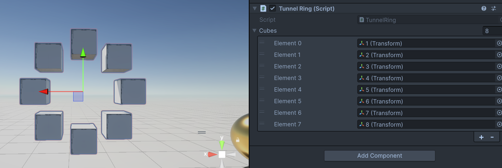
테스트로 수동으로 큐브를 넣어 원형 배치를 확인한 모습

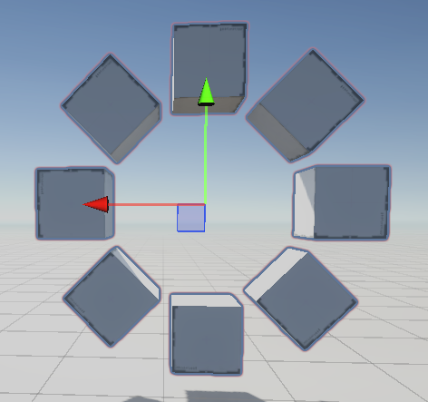
다만 이대로면 터널 같은 비주얼이 아닌 단순한 원형 배치기에 각각의 큐브를 방사형으로 배치된 위치의 각도에 따라 중심에서 바깥쪽을 향해 기울여준다.
```cs
_cubes[i].rotation = Quaternion.Euler(0f, 0f, angle * Mathf.Rad2Deg);
```

---
> **Mathf.Deg2Rad**
>
> `Mathf.Sin`, `Mathf.Cos`는 라디안(radian)을 입력으로 받는다. 사람은 각도를 도(degree)로 생각하지만 수학 함수는 라디안을 쓰기 때문에 변환이 필요하다.
> [라디안 - 위키백과](https://ko.wikipedia.org/wiki/%EB%9D%BC%EB%94%94%EC%95%88)
>
> **라디안이란?** 원의 반지름과 같은 길이의 호가 이루는 각도를 1 라디안이라고 한다. 원 한 바퀴(360도)의 호 길이는 `2πr`이므로, 360도 = 2π 라디안이다.
>
> **변환 공식:** `라디안(rad) = 도(degree) × (π / 180)`
>
> `Mathf.Deg2Rad`는 이 `π / 180`을 상수로 저장해둔 것이다 (≈ 0.01745). 반대로 `Mathf.Rad2Deg`는 `180 / π`로 라디안을 도로 되돌릴 때 쓴다.
>
> **예시:**
> ```
> 90도 × Mathf.Deg2Rad = 90 × 0.01745 ≈ 1.5708 (= π/2)
> Mathf.Cos(π/2) = 0
> Mathf.Sin(π/2) = 1
> → 원의 꼭대기 (0, 1) 좌표
> ```
>
> 
> X축 = Cos(θ), Y축 = Sin(θ)로 원 위의 좌표가 결정되는 원리

---

#### ObjectPool 스크립트 작성
터널 큐브는 플레이어 전방에 생성되고 후방으로 벗어나면 회수되는 순환 구조이므로, 매번 Instantiate/Destroy 하는 대신 오브젝트 풀링으로 재사용한다.

`Queue<T>` 기반 FIFO 구조의 제네릭 풀로 구현했다. 먼저 반환된 오브젝트가 먼저 재사용되어 큐브가 균등하게 순환한다. 생성자에서 initialSize만큼 미리 Instantiate하여 런타임 중 순간적인 생성 부하를 방지하고, 풀이 비어있을 때는 자동으로 추가 생성하여 풀 고갈에도 대응한다.

제네릭(`where T : Component`)으로 만들어 큐브 외에 다른 오브젝트에도 재사용 가능하다.

#### TunnelGenerator 스크립트 작성

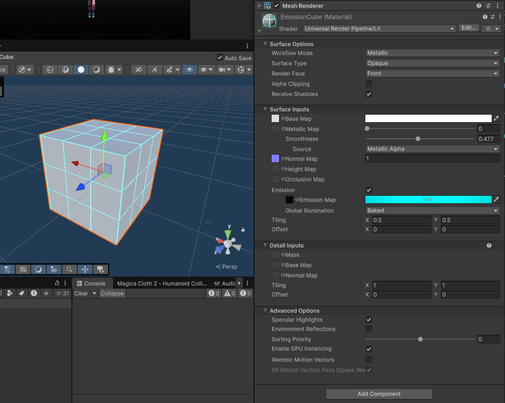
기본 단위가 될 에미션 큐브 프리팹 제작. 무채색 베이스에 이미션 라인으로 터널 내부에서 빛나는 와이어프레임 느낌을 구현했다.

TunnelRing 프리팹은 빈 GameObject + TunnelRing 스크립트만 붙인 빈 그릇으로, 런타임에 TunnelGenerator가 큐브 풀에서 꺼내서 채워준다.

**구조:**
- `ObjectPool<Transform>` (큐브 풀)과 `ObjectPool<TunnelRing>` (링 풀)을 분리 운영
- `SpawnRing()`에서 링 풀과 큐브 풀 양쪽에서 꺼내 조립
- 큐브 스케일은 호 길이(`2πr / 큐브 수`)와 링 간격 기반으로 자동 계산하여 빈틈 방지
- 1.05f 오버랩으로 카메라 각도에 따른 미세한 틈까지 커버

**트레드밀(런닝머신) 방식 무한 스크롤:**
플레이어가 앞으로 나아가는 대신, 터널 전체가 플레이어를 향해 `-Z`로 이동한다. 플레이어는 제자리에서 달리는 애니메이션만 재생하면 된다. 플레이어를 실제로 이동시키면 float 좌표의 스케일 한계로 먼 거리에서 Jittering이 발생할 수 있기 때문에, 세계를 움직이는 방식을 선택했다.

플레이어 뒤로 벗어난 링은 큐브를 분리(`DetachCubes`)하여 풀에 반환하고, 링 자체도 풀에 반환한 뒤 터널 맨 앞에 새 링을 생성하여 순환시킨다.

**발견 및 수정한 버그:**

1. **`_nextSpawnZ` 이격 현상**: 링들은 매 프레임 `-Z`로 이동하는데 다음 스폰 좌표는 고정되어 있어서, 시간이 지나면 새로 생성된 링이 기존 터널과 이어지지 않고 동떨어져 생성됐다. `RecycleRings()`에서 링이 이동한 만큼 `_nextSpawnZ`도 함께 감소시켜 해결.

2. **직육면체 스케일 덮어쓰기**: `UpdateVisual`에서 `Vector3.one * scale`로 스케일을 갱신하면서 `SpawnRing`에서 계산한 직육면체 비율이 매 프레임 정육면체로 리셋됐다. `_baseScales` 배열에 초기 스케일을 보존해두고, 거기에 오디오 반응값을 곱하는 방식으로 수정.

**환경 설정:**
- 카메라 Background Type을 Solid Color(검정)로 변경하여 터널 외부를 완전히 어둡게 처리
- 빌트인 Fog를 검정으로 설정하여 터널 끝이 어둠 속으로 자연스럽게 사라지도록 연출
- Far Clipping Plane을 터널 길이에 맞춰 축소하여 불필요한 원거리 렌더링 제거

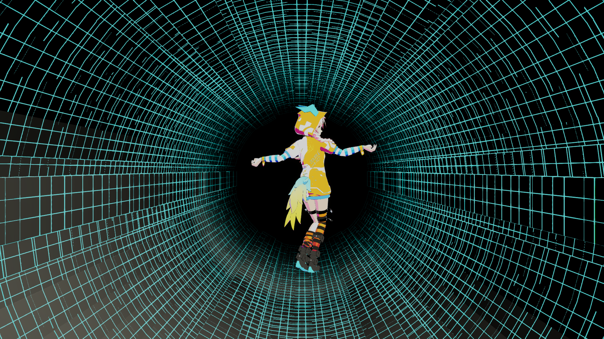
터널 내부에서 캐릭터가 보이는 인게임 모습

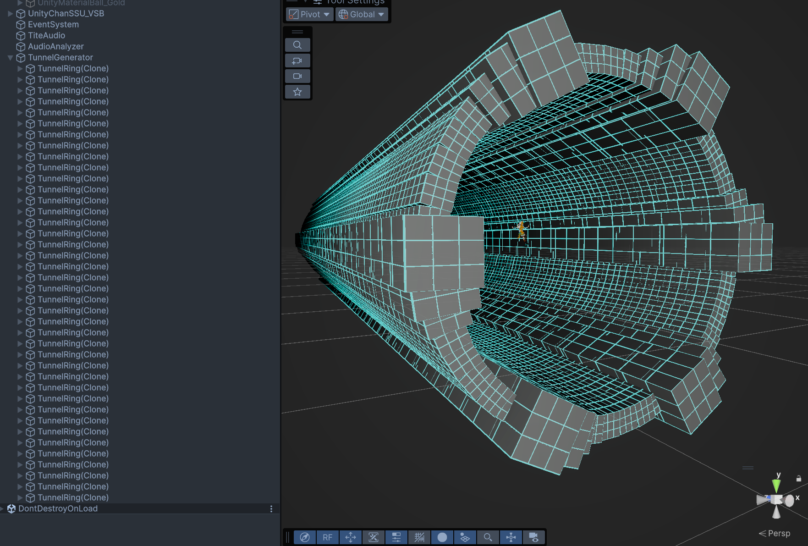
씬 뷰에서 본 터널 전체 구조

---

### 캐릭터 구현 및 게임성 방향성

#### 1. 인터랙티브 아트 게임

- 트레드밀(Treadmill) 구조의 이점을 극대화하여, 캐릭터가 전진하는 것이 아니라 유저의 입력에 따라 다가오는 월드의 시간과 색채가 통제되는 공감각적 연출에 집중한다.

#### 2. 조작 체계 및 시간 제어 (Time Control) 연출

- **W키 (유지) - 정상 재생:**
- `TunnelGenerator`의 월드 스크롤 속도가 트랙 기본 속도(`trackScrollSpeed`)로 부드럽게 복구된다.
- `AudioSource`의 Pitch가 1로 돌아오며 음악이 정상 재생된다.
- 큐브의 네온 라이팅(Emission)과 배경의 색상이 활성화되어 역동적인 시각 효과를 준다.


- **W키 (해제) - 테이프 스탑 (Tape Stop):**
- 조작을 멈추면 터널 스크롤 속도가 서서히 0으로 감소하며 월드가 멈춘다.
- `AudioSource`의 Pitch가 0으로 떨어지며 테이프가 찌익- 하고 늘어지는 듯한 사운드를 연출한다.
- 화면 전체가 무채색(흑백)으로 짙어지고 큐브들의 에미션이 소등되며, 세상의 시간이 멈춘 듯한 적막감을 극대화한다.

- 오디오 믹서 기능 활용 검토

- **Space (점프):**
- 물리적인 글로벌 좌표 이동 없이, 로컬 Y축 연산과 점프 애니메이션만으로 보여주는 시각적 부가 요소

#### 3. 기술적 구현 포인트

- **오디오 제어:** `AudioSource.pitch` 값을 `Mathf.Lerp`로 보간하여 월드의 이동 속도와 사운드를 완벽히 동기화한다.
- **포스트 프로세싱 제어:** 런타임에 Beautify(또는 Unity Volume Profile)에 접근해 채도(Saturation) 값을 조절하여 씬의 흑백 전환을 가볍게 처리한다.
- **머티리얼 배칭 유지 (핵심):** 다량의 큐브의 머티리얼에 개별 접근(`Renderer.material`)하면 인스턴싱이 파괴되고 프레임 드랍이 발생한다. 이를 방지하기 위해 `Shader.SetGlobalFloat`을 사용, 글로벌 셰이더 변수 하나로 전체 네온사인의 On/Off를 일괄 제어하여 Draw Call 스파이크를 원천 차단한다.

---

### Day 6 - 2026-03-03 (지형 생성 및 캐릭터 이동)

#### PlayerController 스크립트 작성

3인칭 StarterAsset의 애니메이터와 애니메이션을 그대로 활용하되, 물리(Rigidbody/CharacterController) 없이 순수 수학 연산으로 캐릭터를 제어한다. 트레드밀 방식에서 캐릭터는 실제로 이동하지 않으므로, 물리 기반 이동이 불필요하고 오히려 복잡성만 늘린다.

**이동 (Tape Stop 연동):**

입력값(`MoveInput.y`)을 `Mathf.Clamp01`로 0~1 범위로 정규화한 뒤 `_maxRunSpeed`를 곱해 목표 속도를 산출한다. `Mathf.Lerp`로 현재 속도를 부드럽게 보간하여 가속/감속 곡선을 만든다.

```cs
float targetSpeed = Mathf.Clamp01(moveY) * _maxRunSpeed;
_currentSpeed = Mathf.Lerp(_currentSpeed, targetSpeed, Time.deltaTime * _speedLerpRate);
```

다만 Lerp는 목표값에 수렴만 하고 도달하지 않는 특성이 있어(5.99, 0.99 등), 음악 재생 속도에 미세한 손실이 발생한다. 충분히 가까워지면 목표값으로 스냅 처리하여 정확히 1.0에 도달하도록 했다.

```cs
if (Mathf.Abs(_currentSpeed - targetSpeed) < 0.01f)
    _currentSpeed = targetSpeed;
```

MotionSpeed는 `_currentSpeed / _maxRunSpeed`로 0.0~1.0 비율을 계산하여 애니메이션 재생 속도를 제어한다. W키를 떼면 속도가 0으로 수렴하면서 달리기 -> 걷기 -> 정지로 자연스럽게 블렌딩되고, 동시에 재생 속도도 느려져 테이프 스탑 연출의 기반이 된다.

**점프 (수학 기반):**

InputManager의 `OnJumpAction` 이벤트를 구독하여 점프 입력을 받는다. 점프는 이산적 입력(한 번 누르면 발동)이므로 이벤트 방식이 적합하다. 이동 입력은 매 프레임 연속적으로 값을 읽어야 하므로 Update 폴링을 유지한다.

```cs
// 이벤트 구독 (Start)
InputManager.Instance.OnJumpAction += TriggerJump;

// 이벤트 해제 (OnDestroy) — 앱 종료 시 IsQuitting 체크로 안전 처리
if (Singleton<InputManager>.IsQuitting) return;
InputManager.Instance.OnJumpAction -= TriggerJump;
```

점프 물리는 Rigidbody 없이 직접 계산한다. 매 프레임 중력을 수직 속도에 누적하고, 수직 속도를 Y 위치에 반영하는 구조다.

```cs
_currentVerticalVelocity += _gravity * Time.deltaTime;  // 중력 가속
_currentYPosition += _currentVerticalVelocity * Time.deltaTime;  // 위치 반영
```

Y 위치가 0 이하로 내려가면 착지 처리하여 속도와 위치를 리셋한다. 낙하 중(`_currentVerticalVelocity < 0`)일 때 IsFalling을 활성화하여 애니메이터에서 낙하 포즈로 전환한다.

최종 위치는 `transform.localPosition`의 Y축만 갱신하여, X/Z 위치는 트레드밀 구조에 영향받지 않도록 했다.

**애니메이터 파라미터:**

| 파라미터 | 타입 | 용도 |
|----------|------|------|
| Speed | float | 0~6 블렌드 트리 (정지 → 걷기 → 달리기) |
| MotionSpeed | float | 0~1 애니메이션 재생 속도 (Tape Stop 연동) |
| IsJump | bool | 점프 시작 트리거 |
| IsFalling | bool | 낙하 포즈 전환 |
| IsGrounded | bool | 착지 상태 |

파라미터 문자열은 `Define.Anim` 상수로 관리하여 오타를 방지하고 자동완성을 지원한다.

#### 중간 비주얼 개선 (큐브 중첩 현상 해결 및 형태 안정화)

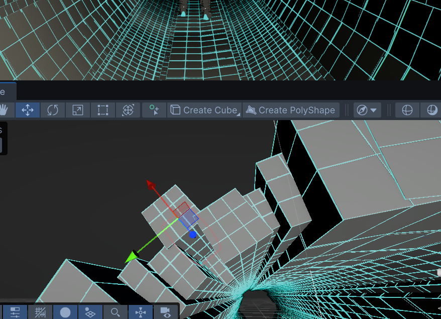

스케일링 중에 큐브끼리 겹치는 면에서 에미션 라인이 겹쳐서 비주얼이 불안정해보인다.  
스케일링이 Y(호 방향)와 Z(터널 진행 방향)까지 키우니까 옆 큐브, 앞뒤 링과 겹친다. 따라서 방사 방향(로컬 X)만 스케일하는 식으로 수정한다.

X: 방사 방향(두께), Y: 호 방향, Z: 터널 진행 방향이다.

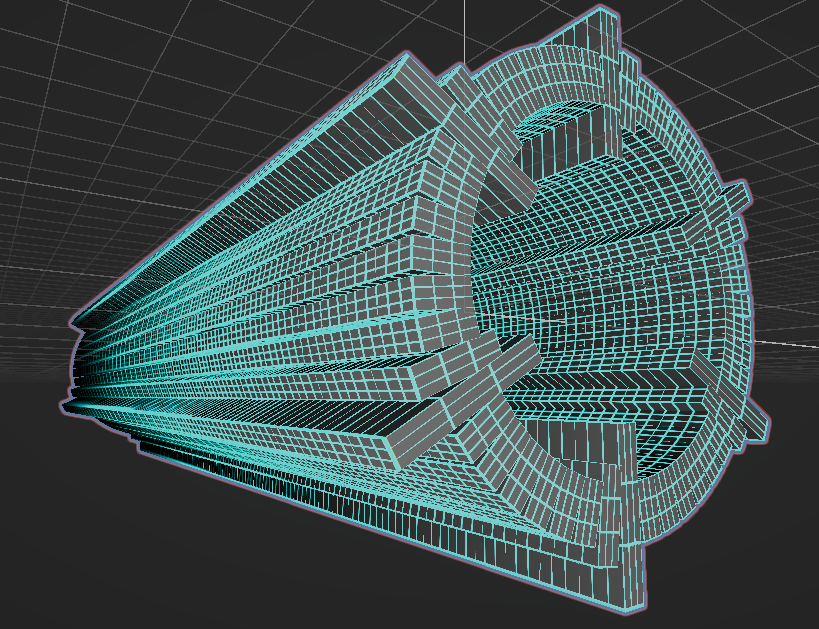

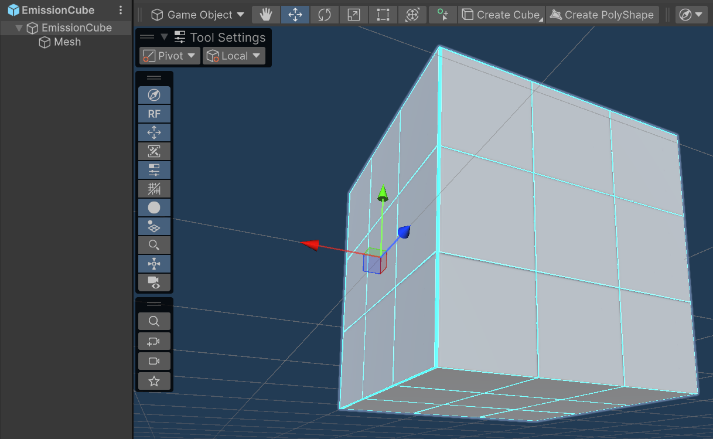
또한 X축이 방사방향이므로 프리팹을 수정해 큐브의 왼쪽 옆면 중심을 원점으로 지정해 터널 바깥이 아닌 터널 안으로만 스케일링하게 만든다.

- 오디오 반응 스케일링 시 큐브의 부피 전체를 키우지 않고 **방사 방향(로컬 X축)**만 스케일링 되도록 로직 수정.
- 프리팹 내부 구조를 수정하여 큐브의 원점(Pivot)을 중앙이 아닌 **왼쪽 옆면 중심(방사 방향의 시작점)**으로 지정.
- 이를 통해 큐브가 양방향으로 커지는 것을 막고, 오직 **터널 안쪽을 향해서만 뻗어 나오게** 만들어 안정적인 터널 형태의 비주얼라이저를 만든다.

반지름이 6일 때의 원통 둘레 공간을 48개로 나누면 $2\pi(6) / 48 \approx 0.785$가 나온다.

해당 방식은 코드로 도입 가능하다보고 다음과 같이 수정했다

- 기존에 인스펙터에서 수동으로 감에 의존해 맞추던 `_cubeThickness` 변수를 주석 처리(제거)하고, 코드를 통해 빈틈없는 호의 길이를 자동 계산하도록 구조 개선.
- 큐브가 터널 안쪽으로 뻗어 나올 때, 이웃 큐브와 겹치지 않는 최대 호 방향 크기는
$2\pi(6) / 48 \approx 0.785$로 도출된다.

오디오 반응 스케일링 시 큐브의 부피 전체를 키우지 않고 **방사 방향(로컬 X축)**만 스케일링 되도록 수정한다.
다만 큐브의 갯수가 너무 적을땐 터널이 작아질 수 있고 터널의 크기에 따라서는 오디오에 따른 스케일 강도를 조절할 필요가 있다. 

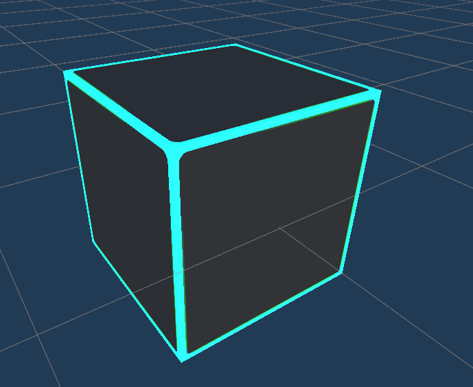
과도하게 많은 이미션 라인을 정리하기 위해 심플한 이미션 큐브 형태의 외형을 변경했다.

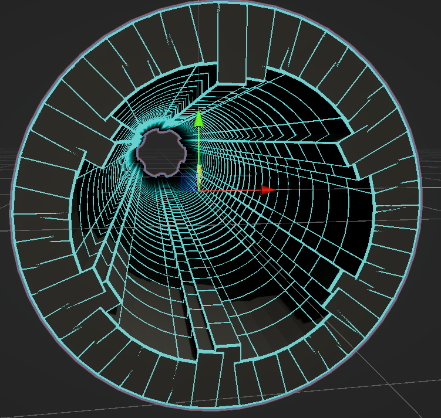


또한 큐브가 겹쳐  Z-Fighting이 일어나는 현상을 방지하기 위해 본래 큐브끼리 살짝 겹쳐서 빈틈을 없애는 용도로 사용한 _overlapRatio 변수를 그 값을 겹치는 현상이 잘 안일어나는 적절한 값으로 인스펙터 상에서 줄여 반대로 큐브끼리 빈틈을 만드는데 사용한다.

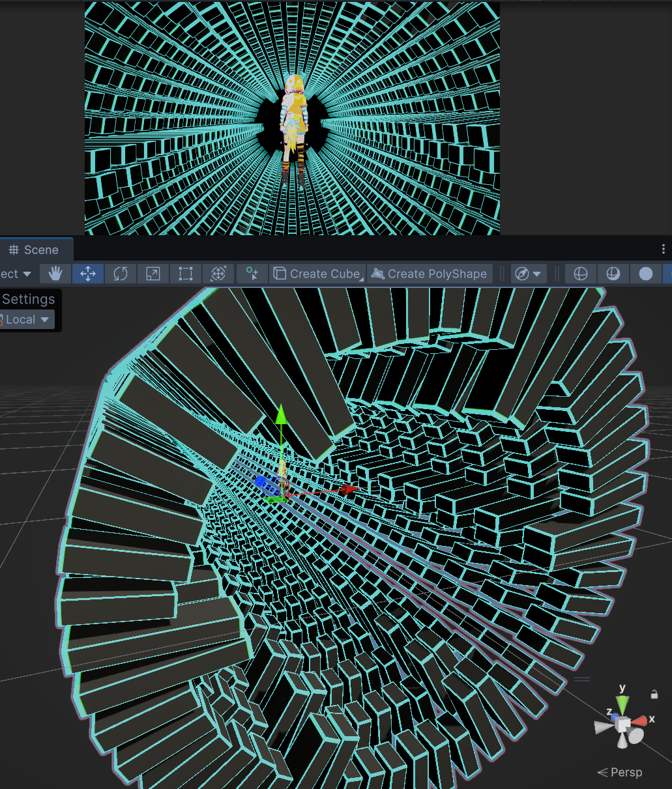
애초에 배경이 검은 색이라 위화감이 없고 각각 큐브의 이미션 라인이 잘보여 비주얼적으로  향상되었다.

#### 테이프 스톱 연출 구현

**핵심 구조:**

W키를 놓으면 "세계의 시간이 멈추는" 연출을 구현했다. PlayerController에서 이미 계산하고 있던 `_currentSpeed / _maxRunSpeed` 비율(0.0~1.0)을 `SpeedRatio` 프로퍼티로 노출하고, 이 하나의 값으로 모든 시스템을 동기화한다.
```
PlayerController.SpeedRatio (0.0 ~ 1.0)
    ├→ Animator: MotionSpeed (애니메이션 재생 속도)
    ├→ TunnelGenerator: scrollSpeed × ratio (터널 감속)
    └→ AudioManager: mixer pitch + snapshot (테이프 스톱 사운드)
```

**AudioMixer 구성:**

AudioSource.pitch를 직접 건드리지 않고 AudioMixer를 경유하는 방식을 선택했다. 믹서를 쓰면 Pitch 외에 Lowpass Filter, SFX Reverb 등 추가 이펙트를 스냅샷으로 한 번에 전환할 수 있어 확장성이 높다. AudioMixer는 Unity 에셋이라 런타임에 동적 생성이 불가능하므로 에디터에서 생성하여 인스펙터에 할당한다.

믹서에 적용한 이펙트:
- **Pitch**: `Expose to Script`로 노출, 코드에서 `SetFloat`로 직접 제어
- **Lowpass Filter**: 테이프 스톱 시 고음을 잘라 물속에 잠기는 듯한 먹먹한 느낌
- **SFX Reverb**: 공간 잔향을 더해 소리가 멀어지는 느낌

**스냅샷 전환:**

Normal(원음)과 TapeStop 두 개의 스냅샷을 만들어 SpeedRatio로 보간한다.

| 파라미터 | Normal (원음) | Tape Stop |
|----------|---------------|-----------|
| Lowpass Cutoff | 22000 Hz | 400 Hz |
| Room (Reverb) | -10000 | -1000 |

Pitch는 스냅샷이 아닌 `SetFloat`로 별도 제어하여 스냅샷과 충돌하지 않는다. 피치 하한을 0.05f로 잡은 이유는 0이 되면 소리가 완전히 끊기지만, 0.05에서는 "찌익—" 하고 늘어지는 테이프 스톱 특유의 느낌이 살아있기 때문이다.

ratio가 1(정속)일 때는 `_normalSnapshot.TransitionTo(0f)`로 즉시 전환하여 Lowpass 보간에 의한 미세한 컷오프 손실(21999Hz) 없이 완전한 원음을 보장한다. ratio가 1 미만이 되는 순간 `TransitionToSnapshots`의 보간이 시작된다.

보간 시간을 `Time.deltaTime`으로 설정하여 스냅샷이 SpeedRatio를 즉시 추종하도록 했다. 부드러운 감속의 원천은 PlayerController의 Lerp 하나로 통일되어 이중 보간이 발생하지 않는다.

### Day 7 - 2026-03-04 (오디오 상호 작용 및 비주얼 연동 폴리싱)
이미션 강도 반응, 포스트 프로세싱, UI 타이틀 화면 착수

#### Post Processing 작업(LookDev)

우선 비주얼 작업을 하기에 앞서 터널을 에디터 모드에서 비주얼을 확인하기 위해 플레이 모드에서 프로젝트 창으로 드래그해 프리팹을 만든 후 씬에 배치해 작업을 진행했다.

Beautify를 Global Volume에 추가한다.

화면을 보며 조정.
톤매핑은 화려한 네온 느낌의 이미션과 툰셰이딩 캐릭터에 어울리는 리니어로 설정한다.
채도는 기본설정 유지
밝기와 대비를 기존 대비 약 1.2배 정도 올려 시각적 대비를 강화시킨다.

Bloom은 이미션의 네온스러운 느낌을 살리는데 있어 필수적이다.
다만 너무 과도하지 않게 수치를 조정하고 퍼지는 정도를 약하게 설정한다.
또한 안티플리커 옵션을 켜서 블룸의 점멸과 필요 이상의 확산을 막는다.

그리고 Beautify의 강점 중 하나인 Anamophic Flares를 켜준다.
카메라에서 빛이 아나모픽 렌즈에 의해 길게 늘여지는 듯한 효과를 연출한다.
이것도 블룸처럼 퍼지는 정도와 강도를 적절한 선에서 조절하고 안티플리커 옵션으로 점멸을 방지한다.
라이팅의 글리치 같은 느낌과 디지털 미디어스러운 느낌을 강화했다.

마지막으로 Vignette를 적용하여 외곽을 어둡게 처리하고 화면 중심에 집중할수 있게한다.


왼쪽 Beautify 적용 전 / 오른쪽 Beautify 적용 후

#### 터널 이미션 반응 추가

SpeedRatio와 오디오 펄스 두 가지를 결합하여 터널 큐브의 이미션 강도를 제어한다.

**구조:**
```
SpeedRatio (테이프 스톱 비율) × (1.0 + audioPulse (저음부 반응))
    → _cubeMaterial.SetColor(EmissionColor, themeColor * intensity)
```

- SpeedRatio가 1(정속)일 때 themeColor 원본 + 오디오 펄스로 밝기가 맥박침
- SpeedRatio가 0(정지)일 때 `_minEmissionIntensity`까지 내려가며 오디오 펄스도 무효화되어 암전

**배칭 유지:**

`Renderer.material`로 개별 접근하면 머티리얼 인스턴스가 복제되어 SRP Batcher가 깨진다. 모든 큐브가 같은 머티리얼을 공유하므로 큐브에서 공통적으로 사용하는 머티리얼 하나에 `SetColor`를 호출하여 전체 큐브가 동시에 반응하면서 배칭을 유지한다.

처음에 `Shader.SetGlobalColor`로 시도했으나, SRP Batcher의 UnityPerMaterial CBUFFER가 글로벌 값보다 우선하여 반영되지 않았다. `Material.SetColor`는 해당 CBUFFER를 직접 갱신하므로 정상 동작한다.

**오디오 펄스 제어:**

AudioAnalyzer의 BandBuffer[0](저음부/킥)을 `_emissionPulseMultiplier`로 증폭한 뒤 `Clamp01`로 상한을 잡았다. 상한이 없으면 킥 타이밍에 intensity가 5~6까지 튀어 눈이 아프고 에미션 라인 선명도가 떨어진다. 멀티플라이어를 0.1 정도로 낮게 설정하여 은은하게 맥박치는 수준으로 튜닝했다.

**themeColor:**

TrackData(SO)의 `themeColor`를 `[ColorUsage(false, true)]`로 HDR 대응하여, 곡마다 다른 네온 색상이 터널에 자동 적용되는 구조다.

#### 색수차(ChromaticAberration) 반응 추가

[Beautify3 URP 공식문서](https://kronnect.com/docs/beautify-urp/scripting/)를 참고하여 스크립트로 색수차를 제어한다.

#### TrackData(SO) 수정을 통한 곡별 비주얼 수정 작업 진행
런타임 중에 themeColor를 수정하는 식으로 SO를 통해 곡 분위기에 맞는 컬러로 편리하게 수정함


### Day 8 - 2026-03-05 (UI 작업 & 최종 연동 작업 및 최적화)
UI 마무리, 씬 연결 및 초기화 작업, 버그 수정, 빌드, 배포

### 최종 빌드
Day 7 일과 마무리 후 최종 빌드

### Day 9 - 2026-03-06 (최종 제출 및 문서 마무리)
오후 1시까지 프로젝트 최종 제출 및 오전 중 문서작업 마무리