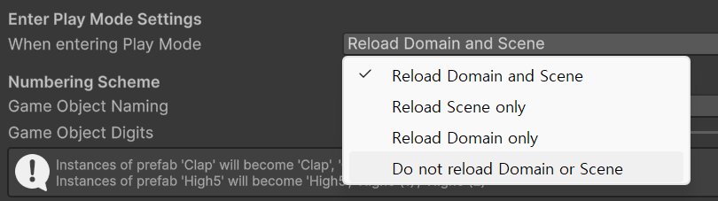

# Monotrum_작업 노트

**작성자**: 이성규  
**게임명**: Monotrum (모노트럼)  
**작성일**: 2026-02-24  
**최종 수정**: 2026-02-26

## 프로젝트 개요

- **진행 기간**: 2026.02.26(목)~2026.03.06(금): [6일]
- **개발 환경**: Unity / C#
- **유니티 버전**: 6.3 LTS

### **프로젝트 목표**
1. **오디오 리액티브 지형 생성** — `GetSpectrumData()`와 `FFTWindow`를 활용하여 오디오 스펙트럼 데이터 기반의 실시간 지형 및 비주얼 변경 구현
2. **체험형 오디오 런 액션** — 리듬게임의 난이도 장벽을 배제하고, 음악과 시각 경험을 동시에 제공하는 러닝 액션 게임
3. **대비적 툰쉐이딩 캐릭터** — 무채색 배경 위에 화려한 툰쉐이딩 캐릭터를 배치하여 시각적 대비 효과 극대화
4. **최소 리소스, 최대 비주얼** — 포스트 프로세싱 + 절차적 맵 생성을 통해 최소한의 리소스로 만족스러운 시각적 경험 달성

---

## 에셋 및 리소스 구성

### 비주얼 에셋 (개인 소유 유료)

개인 소유 유료 에셋을 통해 게임 비주얼의 향상에 사용한다.

**Modern UI Pack** — [Asset Store](https://assetstore.unity.com/packages/tools/gui/modern-ui-pack-201717)  

게임 분위기에 맞는 깔끔한 느낌의 UI 에셋 사용

**Beautify 3 - Advanced Post Processing** — [Asset Store](https://assetstore.unity.com/packages/vfx/shaders/fullscreen-camera-effects/beautify-3-advanced-post-processing-233073)

BIRP 및 URP와 호환되는 포스트 프로세싱 에셋으로 기존 유니티 기본 후처리보다 다양하고 퀄리티 높은 후처리 기술을 다수 제공한다.

**LUT Pack for Beautify**
 — [Asset Store](https://assetstore.unity.com/packages/vfx/shaders/fullscreen-camera-effects/lut-pack-for-beautify-202502)
Beautify 3를 위해 만들어진 LUT 텍스쳐로 비주얼 개선 및 화면 전체 색상의 일관성을 확보한다.

### 편의성 플러그인

**RiderFlow** — [Asset Store](https://assetstore.unity.com/packages/tools/level-design/riderflow-218574)

에디터 내 코드 확인/수정, 에셋 검색 및 배치, 게임 오브젝트 북마크, 씬뷰 카메라 시점 저장, 하이어라키 커스텀 및 메모 기능 제공

### Unity 패키지

**ProBuilder**: 큐브 이외의 도형이 필요한 경우 사용<br>
**Recorder**: 인게임 스크린샷 및 녹화를 위해서 설치<br>
**TextMeshPro**: UI 표시용으로 필수 설치<br>
**Cinemachine**: 카메라의 동적인 움직임을 위하여 설치

### 음악


유튜브 오디오 보관함의 로열티 프리 음악을 사용한다. 2차 배포가 금지되어 있으므로 `.gitignore` 처리된 임포트 폴더에 별도 관리한다.

### 폰트

**Google Noto Sans** — https://fonts.google.com/noto  
SIL Open Font License로 배포 허용. 라이선스 파일을 포함하여 커밋 가능.

### 3D 캐릭터

**Unity-Chan (ユニティちゃん Sunny Side Up)**  
다운로드: https://unity-chan.com/download/releaseNote.php?id=ssu_urp

**선정 이유**: 무채색 배경과의 색상 대비 효과가 뛰어나고, 캐릭터의 후드와 신발의 외형이 음악을 들으며 달리는 게임 컨셉에 적합하다.

---

## 작업 일지

### 2026-02-24 (사전 작업)

프로젝트 Monotrum 기획서 작성 및 사용 기술 검토

### Day 1 — 2026-02-26 (작업 시작)

#### 기초 프로젝트 세팅

- Unity 6000.3.9f1 버전으로 URP 3D 프로젝트 생성
- 각종 에셋 및 패키지 임포트
- 폰트 임포트 및 SDF 생성

##### 캐릭터 임포트

캐릭터를 가져오기 전, 다음 패키지를 선행 설치한다

- **Unity Toon Shader** - [매뉴얼](https://docs.unity3d.com/Packages/com.unity.toonshader@0.13/manual/installation.html)
  - `com.unity.toonshader`을 통해 패키지 파일을 설치한다.
- **Unity Chan Spring Bone** - [GitHub](https://github.com/unity3d-jp/UnityChanSpringBone.git#1.2.1-preview)
  - 캐릭터 본 물리 움직임을 담당한다.

#### 캐릭터 가져오기

- 다운로드 받은 프로젝트 파일을 연다.
  - 사진과 같이 잘 세팅된 캐릭터를 확인할 수 있다.

- 
- 다운로드 받은 프로젝트에서 캐릭터만 패키지 파일로 추출하여 작업 프로젝트에 임포트했다

- 
- 가져오는데 성공한 모습

#### 추가 리소스 임포트


**Unity-Chan! Model** 에셋을 추가 임포트하여 부족한 애니메이션 리소스를 보충했다.

다만 해당 에셋의 애니메이션이 개발 방향에 적합하지 않아, **Starter Assets - ThirdPerson** ([Asset Store](https://assetstore.unity.com/packages/essentials/starter-assets-thirdperson-updates-in-new-charactercontroller-pa-196526)) 에셋의 애니메이션을 대신 활용한다.


#### 정상동작 확인 및 성능 이슈 확인

스타터 에셋의 애니메이션이 정상 동작하는걸 확인


하지만 테스트 중에 프레임이 무거워지거나 끊기는 현상 확인.
프레임이 일정하게 유지 되지 않는다.


따라서 프로파일러를 확인한 결과 캐릭터의 본을 움직여주는 Spring Bone에서 1.1 KB GC Alloc이 발생하는 성능 이슈를 확인했다.

CPU Main 9.9ms: 스크린샷에서는 CPU 연산 시간이 9.9ms로 렌더 스레드(5.0ms)보다 훨씬 길게 잡히며 그 이유 중 하나가 이 높은 폴리곤 수와 스프링본 연산의 결합 때문일 가능성이 크다.


또한 해당 캐릭터는 58개의 스프링본을 처리하는데 있어 성능을 많이 잡아먹는 것을 유추할 수 있었다.

#### 해결 과정

`Unity Chan Spring Bone`은 꽤 옛날에 만들어진 시스템으로 현대에 와서 사용하기엔 성능 이슈가 있을 수 있다. 따라서 쉽고 빠르게 성능 좋은 피직스본을 도입하기 위해 `Magica Cloth 2` 에셋을 도입한다.


[Magica Cloth 2-AssetStore](https://assetstore.unity.com/packages/tools/physics/magica-cloth-2-242307)

Unity DOTS를 사용해 멀티스레딩을 지원하므로 CPU에 코어(스레드)가 많은 기기일수록 성능 향상 폭이 크다.  
지속적인 업데이트 및 유니티6로 넘어와서 생긴 신기능들에 대한 지원에도 적극적인 에셋이다.

[Magica Cloth 2_성능 분석 포스트](https://wisdom-atelier.tistory.com/m/170)  
[MagicaCloth2-공식문서](https://magicasoft.jp/en/magica-cloth-2-2/)


또한 캐릭터의 본을 시각적으로 확인하기 위해 `Animation Rigging` 패키지를 설치했다.


본 교체 작업 도중의 프로파일러 결과이지만, Magica Cloth는 GC Alloc을 일절 발생시키지 않았다.

다만 에디터 차원에서 부하가 커졌는데, 이는 Magica Cloth가 Burst와 Job System을 사용하기 때문이다. 에디터는 이를 실시간으로 모니터링하는 과정에서 추가 부하가 발생하므로, 실제 빌드 대비 에디터상 성능이 더 낮게 측정된다.

상기에서 언급한 Magica Cloth 2 성능 분석 포스트를 보면,

Burst는 에디터에서는 JIT(Just-In-Time) 방식으로, 빌드에서는 AOT(Ahead-of-Time) 방식으로 컴파일된다. 따라서 **Edit → Project Settings → Editor** 탭에 있는 Enter Play Mode Options를 활용하면 반복적인 플레이 작업 시 Burst가 다시 JIT 컴파일되는 것을 방지할 수 있다.


유니티 6에서는 옵션의 이름이 다르며, **Do not reload Domain or Scene**을 선택한다.

기본값인 Reload Domain and Scene은 플레이 버튼을 누를 때마다 유니티가 모든 C# 스크립트 상태를 초기화하고 씬을 다시 읽는다. 이때 Burst 컴파일러도 다시 확인 과정을 거치며 지연이 발생한다.

Do not reload Domain or Scene을 선택하면 도메인 리로드를 건너뛰므로, 플레이 진입 시간이 대폭 단축된다. Magica Cloth 등의 Burst 코드가 메모리에 Warm 상태로 유지되어 매 실행마다 발생하던 JIT 지연도 크게 줄어든다.

> **주의**: Domain Reload를 끄면 `static` 변수가 플레이 모드 진입 시 초기화되지 않는다. `static` 필드를 사용하는 경우 `[RuntimeInitializeOnLoadMethod(RuntimeInitializeLoadType.SubsystemRegistration)]` 등을 통해 수동 초기화 처리가 필요하다.

다만 이번 프로젝트에서는 개발 일정을 고려하여 Reload Domain and Scene 상태를 유지하기로 했다. Domain Reload를 끄면 모든 static 필드의 수동 초기화를 보장해야 하므로, 제한된 일정 내에서 안정성을 우선했다.


> **Warm 상태란?**
> JIT 컴파일 맥락에서 쓰이는 용어로, 이미 컴파일된 네이티브 코드가 메모리에 캐싱되어 즉시 실행 가능한 상태를 말한다.
> - **Cold**: 엔진 가동 직후, 컴파일 안 됨 (느림)
> - **Warm**: 이미 컴파일 완료, 메모리에 상주 (매우 빠름)


또한 Magica Cloth는 상당히 많은 양의 Job을 사용하므로, 이를 실시간으로 디버깅하면 에디터 부하 및 성능 저하가 크다.


위 이미지와 같이 Burst Job 컴파일을 끄니 에디터 부하가 상당히 감소했다.

### Day 2 — 2026-02-27 (코어 스크립트 작성 & 오디오 분석)

#### 기초 코어 스크립트 작성

개발 편의성을 위해 이전 팀 프로젝트에서 작성한 코어 스크립트를 가져와 편집했다.

**Singleton 스크립트**

제네릭 싱글톤 베이스 클래스로, 모든 매니저의 공통 기반이 된다.

- `_isQuitting` 플래그를 통해 앱 종료 시 싱글톤 재생성을 방지한다. 싱글톤의 파괴 순서는 보장되지 않으므로, 종료 과정에서 다른 오브젝트가 이미 파괴된 싱글톤에 접근하여 다시 생성되는 것을 막기 위함이다.
- `FindFirstObjectByType<T>()`을 사용하여 씬에서 기존 인스턴스를 탐색한다. 싱글톤 특성상 하나만 존재하므로 첫 번째만 찾는 동작이 적합하다.
- `DontDestroyOnLoad`은 루트 오브젝트일 때만 호출하도록 조건을 추가했다. GameManager의 자식으로 배치되는 싱글톤(Logger 등)은 부모의 `DontDestroyOnLoad`을 따라가므로 별도 호출이 불필요하다.
- Awake를 virtual로 선언하여 자식 클래스에서 override할 수 있게 했다. 단, `base.Awake()` 내부에서 인스턴스 등록 및 `DontDestroyOnLoad`이 실행되므로 호출을 누락하면 씬 전환 시 매니저가 삭제된다.
- 런타임 자동 생성 시 `[Singleton] ClassName`으로 네이밍하여 하이어라키 가시성을 확보하고, 씬에 중복 배치된 인스턴스 발견 시 경고 로그 출력 후 자동 삭제한다.

**Logger 스크립트 및 프리팹**

이전 프로젝트에서 작성한 스크립트 및 프리팹을 가져왔다.

- Canvas + TMP를 활용한 오버레이 형태의 프리팹으로, 배경을 반투명 처리하여 게임 플레이를 가리지 않도록 배치했다.
- `Queue<string>` 기반 선입선출 로그 관리로, 최대 라인 수를 초과하면 가장 오래된 로그가 자동 제거된다.
- `string.Join`을 사용하여 큐 내용을 합쳐 UI 텍스트를 갱신한다.
- `Debug.isDebugBuild` 체크를 통해 릴리즈 빌드에서는 동작하지 않도록 방지 처리했다.
- `#if UNITY_EDITOR` + `OnValidate`를 사용하여 에디터에서 인스펙터의 enableDebug 체크박스로 텍스트 표시 여부를 즉시 제어할 수 있다.
- 로그 타입별 색상 구분 (Info: 초록, Warning: 노랑, Error: 빨강) 및 `DateTime` 기반 타임스탬프를 표시한다.

**Define 스크립트 작성**
- 전역적으로 사용하는 상수(Constant) 및 열거형(Enum) 정의.

**GameManager 스크립트 작성**

싱글톤 매니저를 생성(호출)하고 GameManager의 자식으로 등록하는 기능과 커서 잠금/해제 토글 기능이 포함되어 있다.



Logger는 UI 캔버스를 포함한 프리팹으로 구성되어 있어 `RegisterManager`를 통한 자동 생성에 적합하지 않다. 따라서 `Script Execution Order`에서 Logger를 GameManager보다 앞으로 설정하여 Logger의 Awake가 먼저 실행되도록 초기화 순서를 보장한다.

씬 수가 많지 않고 비동기 로딩이나 씬 전환 연출 계획이 없으므로, 별도의 Scene관련 스크립트나 매니저를 두지 않고 GameManager에 종료 함수를 추가했다.

**InputManager 스크립트 작성**

InputSystem 기반으로 입력 값을 처리하는 매니저를 작성했다.


위 이미지와 같이 Input Action Asset을 설정한 뒤, C# 클래스로 생성하여 인스펙터 할당 없이 코드에서 직접 입력 값을 다룰 수 있게 했다.

사용 체크가 필요한 상태체크는 프로퍼티가 아닌 외부에서 접근해 소모할 함수를 만들었다.
```cs
public bool ConsumeCancel()
{
    if (_cancelInput)
    {
        _cancelInput = false;
        return true;
    }
    return false;
}
```

#### 캐릭터 기본 이동 구현

순수히 앞으로 물리 없이 Transform을 통해 앞으로 전진(W 유지), 멈춤(W 떼기), 점프(Space)를 구현한다.
불안정한 물리대신 지형의 높이 값을 따르기 위함

